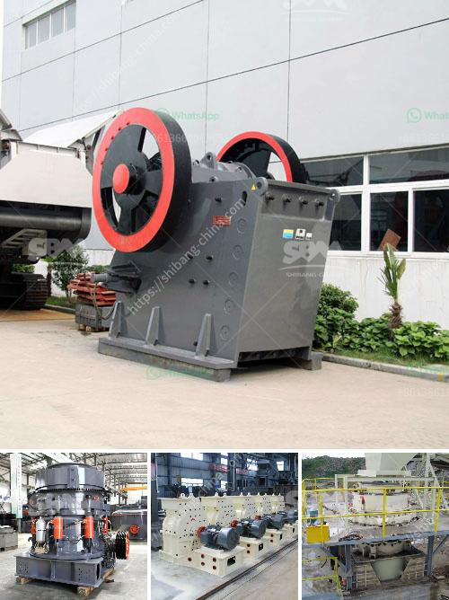

<h3>vertical cement grinding mill from 10 20 tph</h3>
With the continuous progression in the cement industry, vertical grinding mills have become the most preferred option for raw meal and clinker grinding. The main ingredient used for producing cement is clinker, which is grounded and mixed with gypsum and other additives. The resultant product is known as cement, which is used in various construction and infrastructure projects. In this article, we will shed light on the vertical cement grinding mill, its features, and its benefits.

The vertical cement grinding mill is a key equipment in grinding operations that can be widely applied in cement, electric power, metallurgy, chemical, non-metallic minerals, and other industries. It is designed for grinding cement clinker, granulated blast furnace slag, and other mineral powders to ensure optimum particle size distribution.

One of the key features of the vertical cement grinding mill is its compact size. It takes up relatively less space, making it suitable for installation in areas with space constraints. Furthermore, the vertical design allows for a smaller footprint compared to traditional horizontal mills. This not only helps in reducing installation costs but also increases the overall productivity of the plant.

The vertical cement grinding mill is equipped with a grinding system that consumes less energy compared to traditional ball mills. With the use of grinding aids, it is possible to achieve finer particles within a shorter grinding time. This leads to significant energy savings and a lower carbon footprint. Additionally, the vertical mill operates at a lower noise level, creating a more comfortable working environment.

Another advantage of the vertical cement grinding mill is its versatility. It can adapt to different materials and adjust its operating parameters accordingly. This flexibility makes it ideal for grinding various types of cement, such as Portland cement, slag cement, and composite cement. Moreover, it can handle different feed sizes and moisture contents, ensuring consistent product quality.

The vertical cement grinding mill is also recognized for its high drying capacity. It has an integrated drying system that uses the hot exhaust gases from the kiln. This not only improves the grinding efficiency but also eliminates the need for an additional drying unit. As a result, the overall production process becomes more streamlined, reducing operational costs.

In conclusion, the vertical cement grinding mill is a valuable addition to any cement manufacturing plant. Its compact size, energy efficiency, and versatility make it a preferred choice for grinding operations. The ability to grind various types of cement and adjust operating parameters allows cement manufacturers to produce high-quality cement at a lower cost. Furthermore, the integrated drying system enhances the overall production process. With all these advantages, it is no wonder that the vertical cement grinding mill has gained popularity in the cement industry.
<h3>Contact us</h3><ul><li><strong>Whatsapp:&nbsp;<a href="https://wa.me/8613661969651">+8613661969651</a></strong></li><li><a href="https://swt.shibang-china.com/?git&amp;zhl&amp;vertical cement grinding mill from 10 20 tph"><strong>Online Service(chat now)</strong></a></li></ul><h3>Related</h3><ul><li><a href='price for vsi crusher.md'>price for vsi crusher</a></li><li><a href='crusher plant for sale.md'>crusher plant for sale</a></li><li><a href='quote industrial mill quote ball mills.md'>quote industrial mill quote ball mills</a></li><li><a href='gyratory crusher price.md'>gyratory crusher price</a></li><li><a href='jaw crusher 400 600.md'>jaw crusher 400 600</a></li></ul>