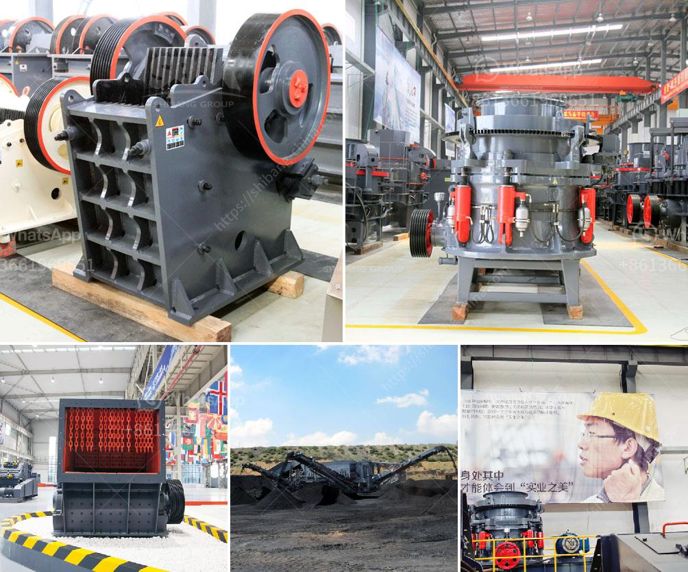

<h3>vertical grinder for spindle</h3>
In the world of machining and precision grinding, the vertical grinder for spindle has emerged as a powerful tool to enhance performance and efficiency. With its unique design and advanced features, this grinding machine has become a go-to solution for numerous industries, from aerospace and automotive to medical and energy sectors.

A vertical grinder for spindle provides a vertical orientation to the grinding wheel and workpiece, allowing for optimal control and precision during the grinding process. Its spindle arrangement, as the name suggests, is vertical, which means the wheel rotates upon the vertical axis, resulting in increased stability and accuracy.

One of the key advantages of a vertical grinder for spindle is its ability to handle larger workpieces. The vertical orientation allows for a larger grinding wheel diameter, allowing for more efficient removal of material. This is particularly beneficial when it comes to grinding large components like turbine blades or engine blocks. The vertical setup also allows for easier access to the workpiece, enabling operators to achieve intricate and precise grinding results.

Another significant advantage of a vertical grinder for spindle is its versatility. These machines can accommodate a wide range of grinding wheels and tools, making them suitable for a variety of applications. From cylindrical grinding and surface grinding to internal and external grinding tasks, a vertical grinder for spindle can handle it all.

Furthermore, the vertical grinder for spindle is designed to ensure maximum precision. The vertical orientation minimizes vibrations and deflection, resulting in improved surface finish and dimensional accuracy. This is crucial when working with tight tolerances or when fine finishes are required.

In conclusion, the vertical grinder for spindle has revolutionized the grinding industry with its exceptional precision, versatility, and efficiency. Its vertical orientation allows for easy access, enhances stability, and minimizes deflection, ensuring superior grinding results. Whether it's grinding larger workpieces or achieving fine finishes, this grinding machine is an invaluable asset for various industries seeking to optimize their machining processes.
<h3>Contact us</h3><ul><li><strong>Whatsapp:&nbsp;<a href="https://wa.me/8613661969651">+8613661969651</a></strong></li><li><a href="https://swt.shibang-china.com/?git&amp;zhl&amp;vertical grinder for spindle"><strong>Online Service(chat now)</strong></a></li></ul><h3>Related</h3><ul><li><a href='gold mining equipment manufacturers in europe.md'>gold mining equipment manufacturers in europe</a></li><li><a href='gold mining compressor price in south africa.md'>gold mining compressor price in south africa</a></li><li><a href='cement clinker grinding equipmenttpd.md'>cement clinker grinding equipmenttpd</a></li><li><a href='coal grinding plant.md'>coal grinding plant</a></li><li><a href='copper processing plants in usa for sale.md'>copper processing plants in usa for sale</a></li></ul>