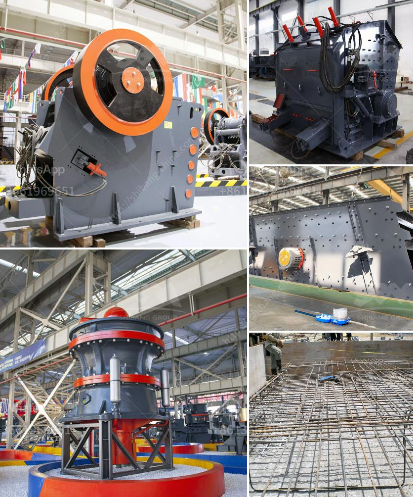

<h3>vertical grinder mill machine</h3>
A vertical grinder mill machine is an essential tool in the industrial sector. It is used to finely grind materials and substances, turning them into powder or micro-particles. This machine is also known as a vertical roller mill, as it works by utilizing vertical pressure exerted by a grinding roller placed on top of a grinding table. With its superior grinding efficiency, it has become a popular choice in various industries for the processing of materials.

One of the main advantages of a vertical grinder mill machine is its space-saving design. Unlike traditional horizontal mills, this machine takes up less floor space, making it more suitable for plants and factories with limited space availability. Additionally, its vertical arrangement allows for efficient material grinding and processing.

The vertical grinder mill machine offers a wide range of applications in different industries. It is commonly used in the cement industry for grinding raw materials, clinker, and coal. In the mining industry, it serves as a crucial tool for grinding ores into fine particles, which are further used in the extraction of valuable minerals. Furthermore, it is also utilized in the chemical and metallurgical sectors for grinding various materials, such as limestone, gypsum, and calcium carbonate.

Advanced technology and innovative features are incorporated into these machines to enhance their performance and productivity. Many vertical grinder mill machines come equipped with automated controls, allowing operators to monitor and adjust grinding parameters easily. This automation ensures consistent and precise grinding results, eliminating human errors and reducing production downtime.

In conclusion, a vertical grinder mill machine is a highly efficient tool used for fine grinding and processing of materials. Its space-saving design, wide range of applications, and advanced features make it a valuable asset in industrial settings. With continuous advancements in technology, these machines are becoming even more versatile and capable of meeting the growing demands of various industries.
<h3>Contact us</h3><ul><li><strong>Whatsapp:&nbsp;<a href="https://wa.me/8613661969651">+8613661969651</a></strong></li><li><a href="https://swt.shibang-china.com/?git&amp;zhl&amp;vertical grinder mill machine"><strong>Online Service(chat now)</strong></a></li></ul><h3>Related</h3><ul><li><a href='cement manufacturing process pdf.md'>cement manufacturing process pdf</a></li><li><a href='equipment cost for silica sand mining.md'>equipment cost for silica sand mining</a></li><li><a href='calcite milling equipment for sale.md'>calcite milling equipment for sale</a></li><li><a href='stone crushers in cali.md'>stone crushers in cali</a></li><li><a href='size pe 600x900 jaw crusher.md'>size pe 600x900 jaw crusher</a></li></ul>