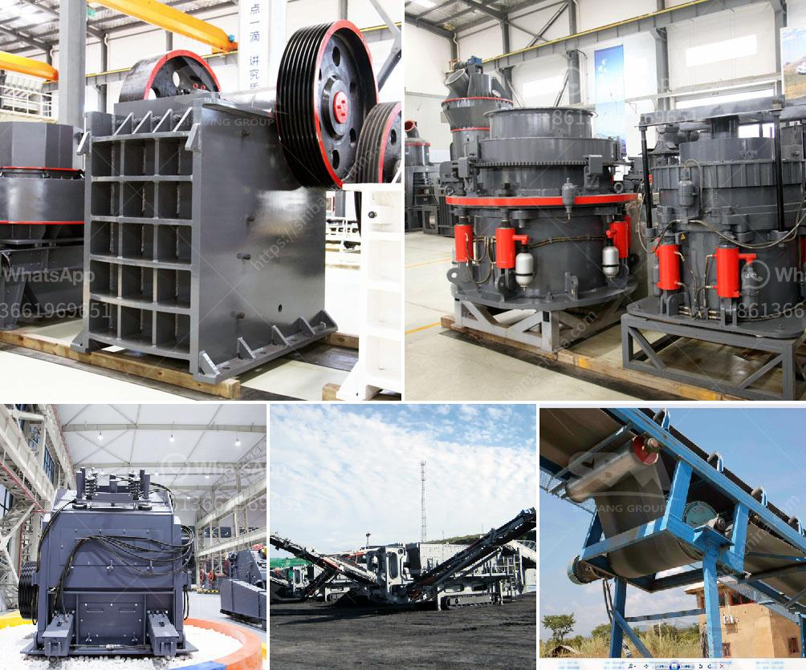

<h3>vertical grinding process</h3>
Vertical grinding is a machining process that takes place on vertical grinding machines, which are designed to hold and rotate the workpiece in a vertical orientation, allowing for the efficient removal of material from the surface. This type of grinding is especially suited for large parts and components that require tight tolerances and high precision.

One of the main advantages of vertical grinding is its versatility. It can be used for a wide range of materials, including metals, ceramics, and composites. This makes it an ideal choice for various industries such as aerospace, automotive, energy, and medical. Additionally, vertical grinding machines can handle both external and internal grinding operations, providing increased flexibility and efficiency.

In the vertical grinding process, the workpiece is securely mounted on a rotary table that rotates at a controlled speed. As the table rotates, the grinding wheel, positioned vertically above the workpiece, moves in a precise path to remove material from the surface. The grinding wheel can have various shapes and can be made of different materials, depending on the specific requirements of the application.

One of the key advantages of vertical grinding is the ability to achieve high precision and accuracy. The vertical orientation of the workpiece and the grinding wheel allows for a more stable and rigid setup, reducing the risk of vibration and ensuring consistent and uniform grinding results. This is particularly important for large parts that require tight dimensional control and surface finish.

The vertical grinding process also offers improved productivity compared to traditional surface grinding methods. The vertical orientation allows for a larger contact area between the grinding wheel and the workpiece, resulting in faster material removal rates. Additionally, the use of modern CNC controls and advanced automation features further enhances productivity by allowing for the programming of complex grinding operations and reducing the need for manual intervention.

Furthermore, vertical grinding machines often feature advanced coolant systems that help to control heat generation and remove chips and debris from the grinding zone. This ensures better cooling of the workpiece and grinding wheel, prolonging their lifespan and reducing the risk of thermal damage or wheel clogging.

In conclusion, the vertical grinding process is a highly efficient machining method that offers numerous advantages over traditional surface grinding. Its versatility, precision, and productivity make it a popular choice for industries that require the grinding of large parts and components. With advancements in machine technology and automation, vertical grinding is poised to continue playing a significant role in the manufacturing industry.
<h3>Contact us</h3><ul><li><strong>Whatsapp:&nbsp;<a href="https://wa.me/8613661969651">+8613661969651</a></strong></li><li><a href="https://swt.shibang-china.com/?git&amp;zhl&amp;vertical grinding process"><strong>Online Service(chat now)</strong></a></li></ul><h3>Related</h3><ul><li><a href='balls in cement grinding.md'>balls in cement grinding</a></li><li><a href='stone crusher machine tutorials.md'>stone crusher machine tutorials</a></li><li><a href='pakistan crusher machine.md'>pakistan crusher machine</a></li><li><a href='crussher stone manufacturer in south africa.md'>crussher stone manufacturer in south africa</a></li><li><a href='caco3 plant parts.md'>caco3 plant parts</a></li></ul>