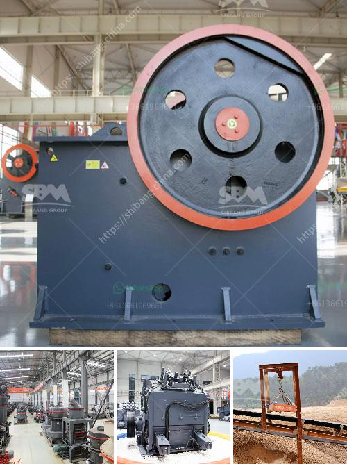

<h3>vertical hammer crusher</h3>
The vertical hammer crusher is a newly developed crushing equipment that integrates the advantages of both hammer crusher and impact crusher. It improves the production efficiency and reduces the factory floor space needed.

The vertical hammer crusher has a wide range of applications in construction, mining, and other industries. Its unique design allows it to crush, pulverize, and shred a variety of materials, including cement, concrete, limestone, and even hard rocks. This makes it an ideal choice for both large and small-scale projects.

One of the key features of the vertical hammer crusher is its simplicity in design and operation. The machine consists of a rigid frame, rotor, hammerhead, grates, upper and lower casing, and motor. The rotor rotates at high speeds, and the hammerhead mounted on it strikes and crushes the materials fed into the crusher.

The vertical hammer crusher is designed with a simple structure, low maintenance costs, and high cost-effectiveness. Its housing and base are made of high-strength materials, which greatly improves its durability and prolongs its service life. The open design of the grates allows for easy maintenance and replacement of the wear parts.

In terms of performance, the vertical hammer crusher is highly efficient and energy-saving. The high-speed rotation of the rotor generates strong centrifugal force, which allows the materials to be crushed with high speed and efficiency. The crushing chamber is deep and wide, ensuring that the materials are thoroughly crushed. The machine also features adjustable discharge sizes, allowing for precise control of the final product.

Another advantage of the vertical hammer crusher is its compact size and small footprint. Compared to traditional crushers, it requires less floor space in the factory, allowing for more efficient use of the available area. Furthermore, its low noise and vibration levels make it suitable for operation in urban areas and residential neighborhoods.

The vertical hammer crusher stands out due to its versatility and adaptability to different applications. It can be used as a primary crusher in a production line, or as a secondary crusher to further reduce the size of the materials. Its ability to handle various materials and produce different particle sizes makes it suitable for a wide range of projects.

In summary, the vertical hammer crusher is a cost-effective and efficient crushing solution that combines the advantages of hammer crusher and impact crusher. It is a valuable machine in construction, mining, and other industries due to its unique design, simplicity in operation, and low maintenance needs. Whether used for primary or secondary crushing, the vertical hammer crusher offers excellent performance and versatility, making it a wise investment for any project.
<h3>Contact us</h3><ul><li><strong>Whatsapp:&nbsp;<a href="https://wa.me/8613661969651">+8613661969651</a></strong></li><li><a href="https://swt.shibang-china.com/?git&amp;zhl&amp;vertical hammer crusher"><strong>Online Service(chat now)</strong></a></li></ul><h3>Related</h3><ul><li><a href='mini rock mobile jaw crusher west africa price in uk.md'>mini rock mobile jaw crusher west africa price in uk</a></li><li><a href='crushing plant philippines.md'>crushing plant philippines</a></li><li><a href='grinding mill machine in greece.md'>grinding mill machine in greece</a></li><li><a href='small scale quarry mining equipment.md'>small scale quarry mining equipment</a></li><li><a href='crushing plant assembly.md'>crushing plant assembly</a></li></ul>