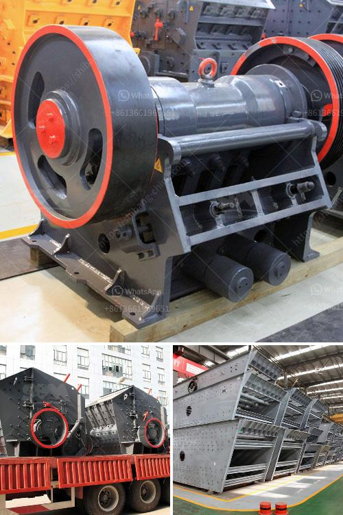

<h3>vertical horizontal milling machine</h3>
Vertical and horizontal milling machines are versatile tools that are used in various industries for machining operations. These machines are capable of performing a wide range of operations such as cutting, drilling, and shaping different types of materials. In this article, we will discuss the features, advantages, and applications of vertical and horizontal milling machines.

Vertical milling machines have a vertical spindle axis, which is aligned vertically to the machine's table. This configuration allows for the cutting tool to move vertically along the Z-axis, which is ideal for operations such as drilling or plunge cutting. The workpiece is typically held in place on the machine's table or vice, and the cutting tool is brought down onto the workpiece to remove material. Vertical milling machines are commonly used for tasks such as face milling, end milling, and keyway cutting.

On the other hand, horizontal milling machines have a horizontal spindle axis, which runs parallel to the machine's table. This configuration allows for the cutting tool to move horizontally along the X-axis, resulting in operations such as milling slots, grooves, and pockets. The workpiece is usually secured to the machine's table or clamped in a vice, and the cutting tool moves across the workpiece to remove material. Horizontal milling machines are often used for tasks such as production milling, gear cutting, and slab milling.

One of the advantages of vertical and horizontal milling machines is their versatility. These machines can be used for a wide range of operations, allowing for the creation of complex parts with high precision. Additionally, vertical and horizontal milling machines can accommodate different sizes and shapes of workpieces, making them suitable for various applications.

Another advantage of these machines is their ability to handle different types of materials. Whether it is plastic, metal, or wood, vertical and horizontal milling machines can effectively cut and shape these materials to meet specific requirements. This flexibility makes them valuable tools in industries such as manufacturing, automotive, aerospace, and construction.

In terms of setup and operation, vertical and horizontal milling machines offer different advantages. Vertical milling machines are generally easier to set up and operate, as the workpiece is visible and easily accessible. Operators can easily see the progress of the machining process and make necessary adjustments. Horizontal milling machines, on the other hand, may require more complex setups due to the orientation of the spindle axis. However, once properly set up, these machines can perform a wider range of operations.

In conclusion, vertical and horizontal milling machines are essential tools in various industries for machining operations. Their versatility, precision, and ability to handle different materials make them indispensable for creating complex parts with high accuracy. Whether it is a vertical or horizontal milling machine, these machines offer unique advantages and contribute to the efficiency and productivity of manufacturing processes.
<h3>Contact us</h3><ul><li><strong>Whatsapp:&nbsp;<a href="https://wa.me/8613661969651">+8613661969651</a></strong></li><li><a href="https://swt.shibang-china.com/?git&amp;zhl&amp;vertical horizontal milling machine"><strong>Online Service(chat now)</strong></a></li></ul><h3>Related</h3><ul><li><a href='raymond mill price list.md'>raymond mill price list</a></li><li><a href='chrome sands washing plant with prices.md'>chrome sands washing plant with prices</a></li><li><a href='coal machinery for coal processing crusher.md'>coal machinery for coal processing crusher</a></li><li><a href='german grinding mill manufacturer.md'>german grinding mill manufacturer</a></li><li><a href='grinding mill prices in harare.md'>grinding mill prices in harare</a></li></ul>