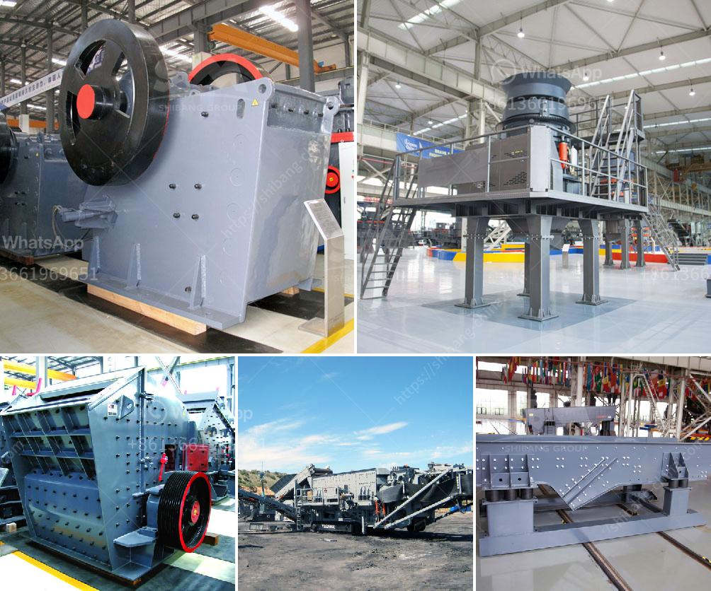

<h3>vertical mill calcium</h3>
In recent years, the calcium carbonate grinding industry has undergone a significant transformation, with the introduction of vertical mill technology. This innovative grinding equipment has revolutionized the traditional grinding methods, providing more efficient and precise solutions for the processing of calcium carbonate.

Calcium carbonate, a widely used industrial mineral, is essential in various industries such as construction, paper, rubber, plastics, and pharmaceuticals. Its unique properties make it a versatile material with extensive applications. However, the traditional methods of grinding calcium carbonate, such as ball mills and Raymond mills, often face limitations in terms of efficiency, energy consumption, and product quality.

Vertical mill technology, on the other hand, has addressed these limitations effectively. By utilizing a vertical grinding chamber and advanced grinding roller technology, vertical mills offer numerous advantages over traditional grinding equipment. Let's delve into some of these significant benefits.

First and foremost, vertical mills have a higher grinding efficiency compared to other grinding equipment. The vertical design of the mill allows the material to be uniformly fed into the grinding chamber, ensuring a thorough and efficient grinding process. This results in a higher production capacity and reduced energy consumption, making it a cost-effective solution for calcium carbonate processing.

Furthermore, vertical mill technology enables precise control over the particle size distribution of the ground calcium carbonate. The adjustable grinding pressure and speed of the grinding rollers allow operators to achieve the desired fineness with exceptional accuracy. This level of control ensures consistent product quality, meeting the specific requirements of various industries.

In addition to its efficiency and control, vertical mills also offer enhanced environmental performance. The enclosed grinding chamber minimizes dust emissions, creating a cleaner and healthier working environment. Moreover, the reduced energy consumption of vertical mills translates to lower carbon emissions, contributing to a more sustainable grinding process.

Another advantage of vertical mill calcium is its ability to handle a wide range of feed materials. Whether it is dry, wet, or even sticky calcium carbonate, the vertical mill can accommodate different types of feed, offering flexibility in production processes. This versatility ensures efficient grinding regardless of the feed material characteristics.

In summary, vertical mill calcium has revolutionized the calcium carbonate grinding industry by providing a more efficient, precise, and environmentally friendly solution. Its higher grinding efficiency, precise control over particle size distribution, and versatile handling of different feed materials have set a new benchmark in the industry. As a result, manufacturers across various sectors can now enjoy increased productivity, improved product quality, and reduced environmental impact.

The adoption of vertical mill technology is poised to accelerate in the coming years, as more industries recognize the benefits it offers. Manufacturers and processors who aim to stay ahead of the competition and achieve sustainable growth should consider integrating vertical mills into their calcium carbonate processing operations. With continuous advancements in technology, the future of the calcium carbonate grinding industry looks brighter than ever before.
<h3>Contact us</h3><ul><li><strong>Whatsapp:&nbsp;<a href="https://wa.me/8613661969651">+8613661969651</a></strong></li><li><a href="https://swt.shibang-china.com/?git&amp;zhl&amp;vertical mill calcium"><strong>Online Service(chat now)</strong></a></li></ul><h3>Related</h3><ul><li><a href='crusher rental companies in oman.md'>crusher rental companies in oman</a></li><li><a href='aggregate stone crusher price south africa.md'>aggregate stone crusher price south africa</a></li><li><a href='stone crushing machines in uk.md'>stone crushing machines in uk</a></li><li><a href='machine price list ball mill for silica sand.md'>machine price list ball mill for silica sand</a></li><li><a href='calcium carbonate mining manufacturer in malaysia.md'>calcium carbonate mining manufacturer in malaysia</a></li></ul>