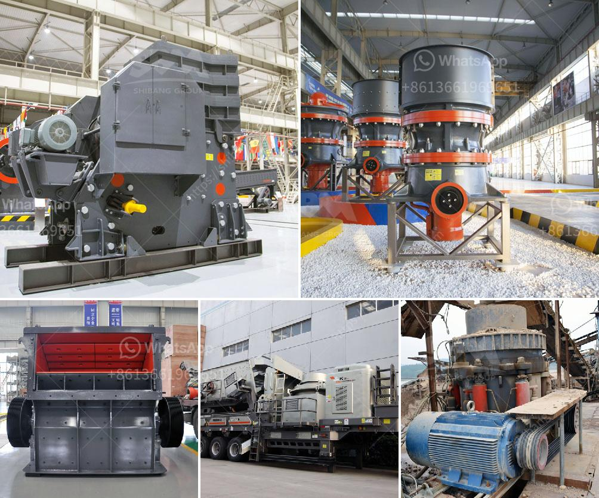

<h3>vertical mill coal</h3>
Vertical mill coal, also known as medium speed coal mill, is a kind of grinding equipment widely used in coal mining industry. It can grind raw coal into suitable particle size for fuel preparation and combustion. Vertical mill coal is one of the main equipment in the pulverized coal preparation system, which can improve the efficiency of coal-fired power plants and reduce the emissions of pollutants.

Compared with traditional coal mills, such as ball mill and Raymond mill, vertical mill coal has the advantages of high grinding efficiency, low power consumption, small abrasion, large drying capacity, and stable operation. This makes it a preferred choice for grinding coal and is widely used in metallurgy, building materials, chemical industry, environmental protection, and other industries.

The working principle of vertical mill coal is relatively simple. After being crushed, the coal is sent to the mill through the feeding device. The coal is pulverized by the grinding roller on the grinding disc, and the fine powder is blown into the powder separator by the hot air. The coarse powder falls directly into the grinding disc for regrinding, while the fine powder is collected by the powder separator and sent to the kiln burner for combustion.

Vertical mill coal adopts the combination of drying, grinding, and powder separation, which greatly reduces the water content in the coal powder, improves the grinding efficiency, and makes the combustion more stable. In addition, vertical mill coal can adjust the fineness of the finished product flexibly according to the actual needs of users, which is conducive to the comprehensive utilization of coal resources.

Vertical mill coal has its unique advantages in coal grinding. Compared with other grinding equipment, it has a larger grinding space, higher drying capacity, and finer particle size of the finished product. It can meet the requirements of different coal types and different process conditions, and has wide adaptability.

In recent years, with the increasing demand for clean energy and the strict requirements for environmental protection, the application of vertical mill coal in coal-fired power plants has become more prevalent. It not only improves the efficiency of power generation but also reduces the emissions of pollutants such as sulfur dioxide and nitrogen oxides.

In conclusion, vertical mill coal is an advanced grinding equipment in the coal mining industry, which has the advantages of high grinding efficiency, low power consumption, large drying capacity, and stable operation. It plays an important role in the pulverized coal preparation system, improving the efficiency of coal-fired power plants, and reducing environmental pollution. With the continuous development of clean energy, the application of vertical mill coal will become more extensive, providing strong technical support for the sustainable development of the coal industry.
<h3>Contact us</h3><ul><li><strong>Whatsapp:&nbsp;<a href="https://wa.me/8613661969651">+8613661969651</a></strong></li><li><a href="https://swt.shibang-china.com/?git&amp;zhl&amp;vertical mill coal"><strong>Online Service(chat now)</strong></a></li></ul><h3>Related</h3><ul><li><a href='quartz rock processing equipment.md'>quartz rock processing equipment</a></li><li><a href='price of gold mining equipment.md'>price of gold mining equipment</a></li><li><a href='quarry crushing plants in south africa.md'>quarry crushing plants in south africa</a></li><li><a href='mobile crusher plant for hire in mpumalanga province.md'>mobile crusher plant for hire in mpumalanga province</a></li><li><a href='medium scale quarry crushing equipment.md'>medium scale quarry crushing equipment</a></li></ul>