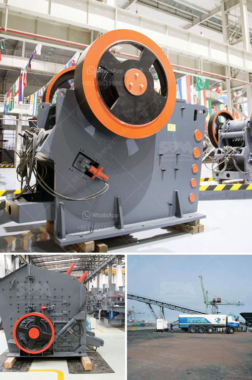

<h3>vertical mill operating principle</h3>
Vertical milling is a highly efficient and versatile machining process that is commonly used in industrial manufacturing. It refers to the process of machining a metal workpiece with a rotating tool that is vertically oriented on the milling machine. This type of milling machine is known as a vertical mill.

The operating principle of a vertical mill is simple. The machine consists of a rotating spindle with a cutting tool attached to it, which is guided through a workpiece that is fixed to a table. The vertical orientation of the spindle allows for easy operation and precise cutting, making it suitable for a wide range of applications.

One of the key advantages of a vertical mill is its ability to perform both simple and complex operations. It can perform basic tasks such as drilling, cutting, and slotting, as well as more advanced operations like contouring and shaping. This makes it a versatile choice for various industries, including automotive, aerospace, and electronics.

The vertical mill operates based on the use of electricity to power the spindle and the movement of the table. When the machine is turned on, the spindle motor starts rotating, providing power to the cutting tool. At the same time, the table can be moved in different directions, allowing for precise positioning of the workpiece.

The main components of a vertical mill include the spindle, table, column, and knee. The spindle is responsible for holding and rotating the cutting tool, while the table is used to secure the workpiece. The column provides vertical support to the spindle assembly, and the knee is responsible for moving the table vertically.

To operate a vertical mill, the operator must first secure the workpiece onto the table using clamps or vises. Once the workpiece is secured, the operator can set the spindle speed and feed rate based on the material being machined. The cutting tool is then lowered onto the workpiece, and the table is moved to start the cutting process.

During the machining process, the cutting tool removes material from the workpiece to create the desired shape or form. The operator must constantly monitor the cutting process to ensure that the tool is cutting at the correct depth and that the tool remains sharp. This may involve making adjustments to the spindle speed, feed rate, or tool position as needed.

In conclusion, the operating principle of a vertical mill involves the use of a rotating spindle with a cutting tool to remove material from a workpiece. This process is controlled by the movement of the table and requires careful monitoring and adjustment to achieve the desired outcome. Vertical milling is a versatile and efficient machining process that is widely used in industrial manufacturing.
<h3>Contact us</h3><ul><li><strong>Whatsapp:&nbsp;<a href="https://wa.me/8613661969651">+8613661969651</a></strong></li><li><a href="https://swt.shibang-china.com/?git&amp;zhl&amp;vertical mill operating principle"><strong>Online Service(chat now)</strong></a></li></ul><h3>Related</h3><ul><li><a href='equipment needed for quarry crusher.md'>equipment needed for quarry crusher</a></li><li><a href='coal mill in power plant.md'>coal mill in power plant</a></li><li><a href='sample business plan for stone crusher pdf.md'>sample business plan for stone crusher pdf</a></li><li><a href='gold wash plant machine in ghana.md'>gold wash plant machine in ghana</a></li><li><a href='cost of cement grinding unit in india.md'>cost of cement grinding unit in india</a></li></ul>