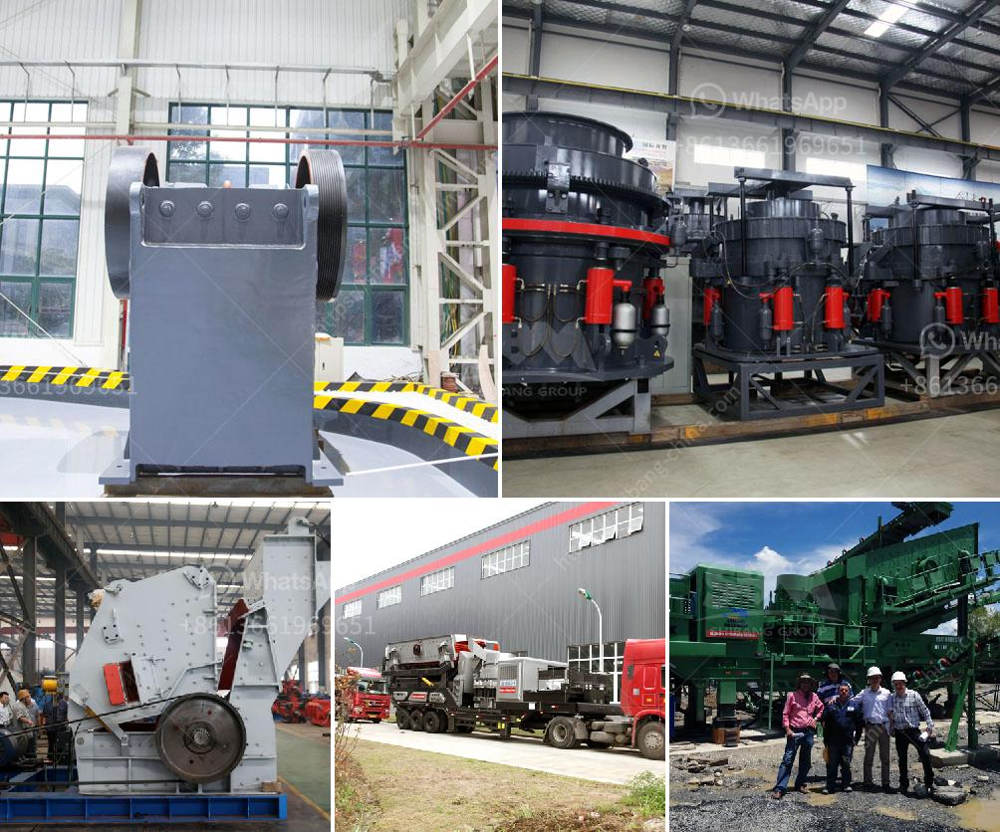

<h3>vertical roller grinding mill for sale</h3>
Vertical roller grinding mill is a type of grinding equipment designed to solve the industrial grinding mill low output, high energy consumption and higher maintenance cost problems. More and more companies and investors of mine and mineral factories are choosing it as their preferred grinding mill for processing non-metallic minerals. Because it's not only superior in performance, but also has a more affordable price compared with other grinding mills. In this article, we will discuss the advantages and characteristics of vertical roller grinding mill for sale.

Firstly, the vertical roller mill combines crushing, drying, grinding, grading, and conveying into one, which greatly reduces the investment cost for customers. It is equipped with a hot air stove system, which can dry the materials while grinding, saving the necessary power consumption for the drying process. Additionally, the materials are transported by the wind conveying system, eliminating the need for a separate conveying device and reducing the investment in equipment.

Secondly, the vertical roller grinding mill is more environmentally friendly. It adopts the advanced pulse dust removal device to significantly reduce the dust emission, which is in line with the national environmental protection standards. Moreover, the entire grinding process is operated in a negative pressure environment, preventing the spread of dust and improving the working environment. This not only protects the health of workers but also meets the requirements of sustainable development.

Thirdly, the vertical roller grinding mill has high production efficiency. Compared with the traditional grinding mill, it can increase production by more than 40% and save energy consumption by more than 30%. The advanced grinding principle and unique roller pressure device ensures the fine powder grinding efficiency and reduces the grinding time. The grinding roller and grinding ring of the mill are made of high wear-resistant materials, ensuring the equipment has a longer service life.

Lastly, the vertical roller grinding mill has a wide range of applications. It can process various non-flammable and explosive materials with a hardness below seven and a moisture content below 6%. It is widely used in electric power, metallurgy, cement, chemicals, building materials, coatings, papermaking, rubber, medicine, food and other fields. The vertical roller grinding mill is compatible with multiple types of mills, such as ball mills, rod mills, and autogenous mills, which makes it suitable for various grinding processes.

In conclusion, the vertical roller grinding mill is an advanced grinding equipment that has many incomparable advantages for industrial grinding. It not only has high production efficiency, but also saves energy consumption and is environmentally friendly. With its wide range of applications and affordable price, it has become the preferred choice for many companies and investors. If you are looking for a high-performance and cost-effective grinding mill, the vertical roller grinding mill for sale is definitely worth considering.
<h3>Contact us</h3><ul><li><strong>Whatsapp:&nbsp;<a href="https://wa.me/8613661969651">+8613661969651</a></strong></li><li><a href="https://swt.shibang-china.com/?git&amp;zhl&amp;vertical roller grinding mill for sale"><strong>Online Service(chat now)</strong></a></li></ul><h3>Related</h3><ul><li><a href='roler mill 10 ton per hoursprice.md'>roler mill 10 ton per hoursprice</a></li><li><a href='mobile crusher plant for hire in mpumalanga province.md'>mobile crusher plant for hire in mpumalanga province</a></li><li><a href='used gold washer machine plant.md'>used gold washer machine plant</a></li><li><a href='gravel vibrating screen.md'>gravel vibrating screen</a></li><li><a href='400 mesh grinding mill equipment.md'>400 mesh grinding mill equipment</a></li></ul>