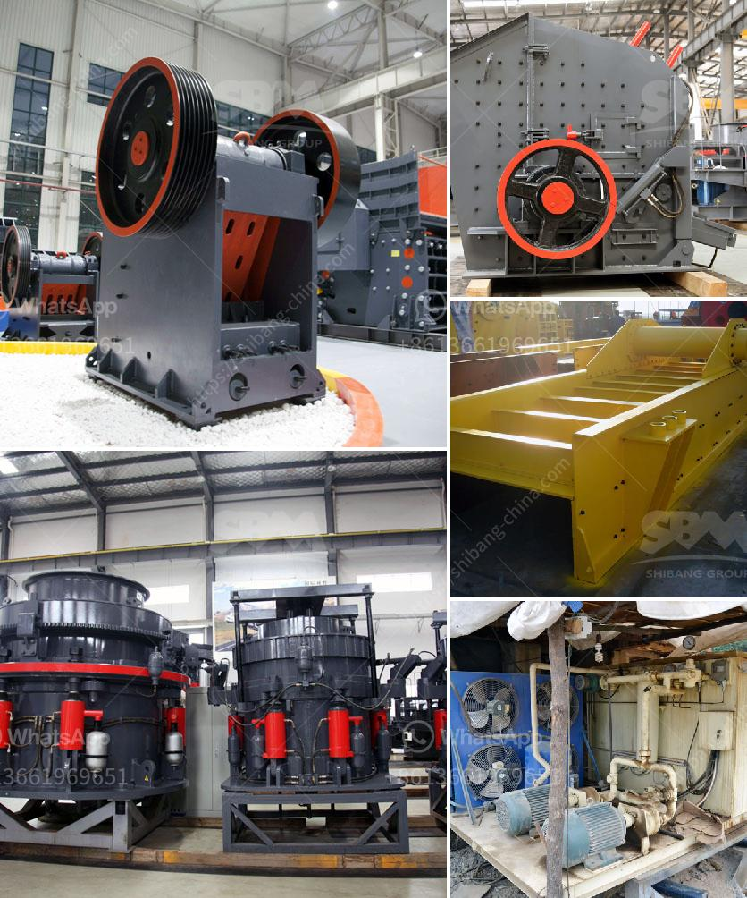

<h3>vertical roller mill coal</h3>
The coal mining industry plays a significant role in the global energy sector. To meet the rising energy demands, coal is being mined and utilized as a fuel source. However, the traditional coal mining process involves several challenges, including environmental concerns. In recent years, there has been a shift towards more sustainable and efficient coal processing methods. Vertical roller mill technology has emerged as an innovative and ideal solution for grinding coal, thus enhancing the overall efficiency and sustainability of the coal industry.

The grinding process in coal mining industries requires high precision and energy efficiency. The traditional ball mill grinds coal with steel balls. However, this process consumes significant amounts of energy, leads to excessive wear of steel balls, and produces a large amount of coal dust emissions. Vertical roller mills, on the other hand, use grinding rollers to crush the coal, ensuring a much higher grinding efficiency while minimizing energy consumption and reducing environmental impact.

The vertical roller mill coal grinding system is generally composed of a vertical roller mill main body, a fine powder collecting device, a fan, and a pipeline. The working process is that the raw coal enters the vertical roller mill and is ground by the air (or hot air) into the classifier, and the fine coal is collected by the fine powder collecting device and then entered into a coal powder bin or a coal powder conveying equipment through a pipeline.

1. High grinding efficiency: The grinding rollers and grinding plates are made of wear-resistant materials, which ensures long-term operation without frequent replacement. This leads to significant cost savings and increased productivity.

2. Low energy consumption: Vertical roller mills require less energy compared to traditional ball mills, making them more energy-efficient. This reduces the overall energy consumption, benefiting both the environment and the coal industry.

3. Low noise and dust emissions: With an enclosed structure, vertical roller mills reduce noise and dust emissions, creating a safer and cleaner working environment. This improves the well-being of workers and minimizes the impact on surrounding communities.

4. Enhanced coal quality: Vertical roller mills produce coal with a finer particle size distribution, resulting in improved combustion efficiency. This leads to lower emissions of pollutants, such as sulfur dioxide and nitrogen oxides.

The adoption of vertical roller mill coal grinding technology in the coal mining industry brings significant improvements in efficiency, productivity, and environmental impact. Its ability to grind coal with high precision and low energy consumption makes it an ideal choice for coal processing. As the world transitions towards more sustainable energy sources, the vertical roller mill coal grinding system contributes to a greener future by enhancing the efficiency and sustainability of the coal industry.
<h3>Contact us</h3><ul><li><strong>Whatsapp:&nbsp;<a href="https://wa.me/8613661969651">+8613661969651</a></strong></li><li><a href="https://swt.shibang-china.com/?git&amp;zhl&amp;vertical roller mill coal"><strong>Online Service(chat now)</strong></a></li></ul><h3>Related</h3><ul><li><a href='used rock crushing plant for sale in uae.md'>used rock crushing plant for sale in uae</a></li><li><a href='hammer mill dimension.md'>hammer mill dimension</a></li><li><a href='gypsum board manufacturing plant.md'>gypsum board manufacturing plant</a></li><li><a href='cost of cement manufacturing plant.md'>cost of cement manufacturing plant</a></li><li><a href='stone crusher machine price in uganda.md'>stone crusher machine price in uganda</a></li></ul>