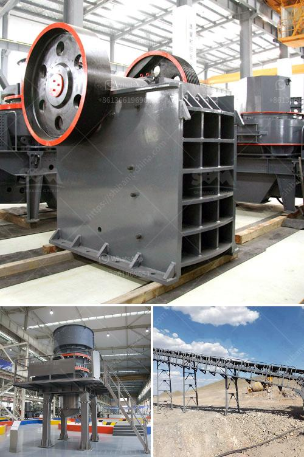

<h3>vertical roller mill manufacturer</h3>
A vertical roller mill is a type of industrial equipment used to crush or grind materials into small particles. These machines consist of a large, rotating tube that contains a series of grinding rollers. In recent years, vertical roller mills have become increasingly popular for their ability to handle a wide range of materials and produce consistent results.

One of the key factors behind the success of vertical roller mills is the quality of the manufacturers. With so many options in the market, it can be challenging to choose the right manufacturer for your specific needs. However, one name that stands out in the industry is XXXX (manufacturer name).

XXXX has established itself as a reputable manufacturer of vertical roller mills, known for their exceptional quality, durability, and performance. Their machines are widely used in various industries such as cement, power, metallurgy, chemical, and many more.

What sets XXXX apart from its competitors is their commitment to continuous innovation and technology advancements. They invest significant resources in research and development to constantly improve their products and meet the changing demands of the market.

Another reason why XXXX is highly regarded is their focus on customer satisfaction. They provide excellent after-sales support and technical assistance to ensure that their customers get the best out of their vertical roller mills. Their team of skilled engineers and technicians are readily available to address any queries or issues that may arise.

Additionally, XXXX also places great emphasis on environmental sustainability. Their machines are designed to be energy-efficient, reducing both operational costs and carbon footprint. They adhere to strict environmental regulations and strive to create products that contribute to a greener future.

In conclusion, XXXX is a trusted and reliable manufacturer of vertical roller mills. With their commitment to innovation, customer satisfaction, and environmental sustainability, they have become a preferred choice for many industries seeking high-quality grinding solutions.
<h3>Contact us</h3><ul><li><strong>Whatsapp:&nbsp;<a href="https://wa.me/8613661969651">+8613661969651</a></strong></li><li><a href="https://swt.shibang-china.com/?git&amp;zhl&amp;vertical roller mill manufacturer"><strong>Online Service(chat now)</strong></a></li></ul><h3>Related</h3><ul><li><a href='used sand dryer for sale australia.md'>used sand dryer for sale australia</a></li><li><a href='cement grinding plant layout.md'>cement grinding plant layout</a></li><li><a href='used in cement plant.md'>used in cement plant</a></li><li><a href='grinding machines for clay.md'>grinding machines for clay</a></li><li><a href='sand in washing machine.md'>sand in washing machine</a></li></ul>