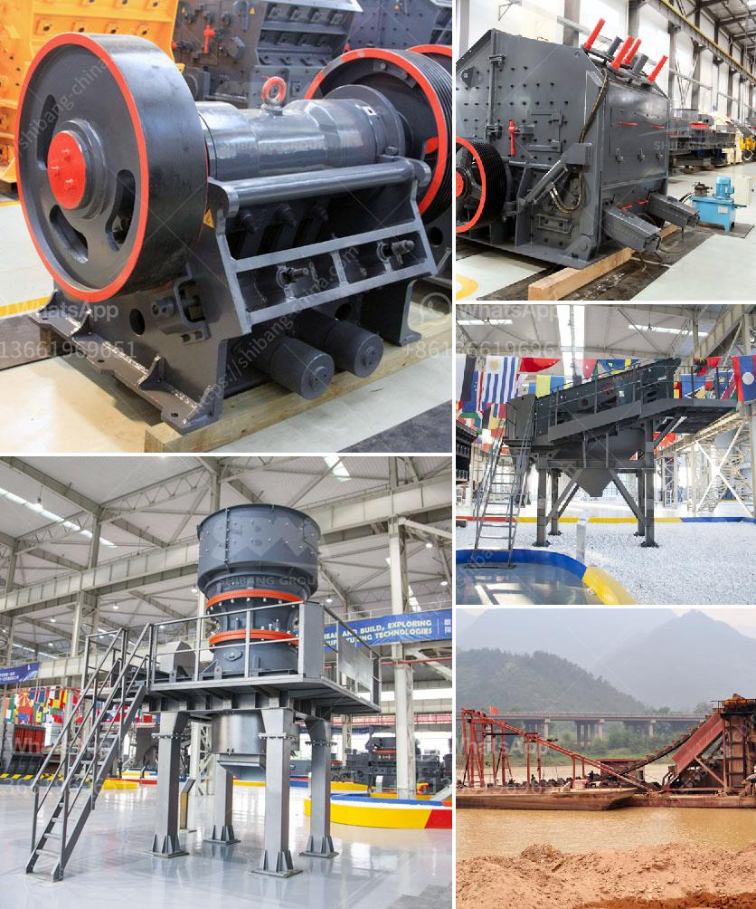

<h3>vertical roller pre grinding mill</h3>
Vertical roller pre-grinding mill is nowadays highly trending and widely used in the cement and mining industry. It allows higher energy efficiency, better grinding efficiency, and better drying capacity compared to traditional ball mills or even impact mills. With the increasing demand for sustainable and eco-friendly solutions, this innovative mill has become an essential component in many grinding processes.

The key feature of the vertical roller pre-grinding mill is the ability to reduce power consumption, thereby enhancing productivity and efficiency. This is achieved through the mill's unique design, which incorporates a vertical roller mounted on a rotating disc. The roller exerts a high pressure on the material, effectively crushing and grinding it, while the rotating disc evenly distributes the material across the grinding table. As a result, the mill ensures uniform particle size distribution and improved grinding efficiency.

Another advantage of the vertical roller pre-grinding mill is its ability to handle a broad range of feed materials. It can efficiently grind everything from limestone and clinker to coal, phosphate, and various industrial minerals. This versatility allows manufacturers to use the mill for different applications without needing additional equipment.

Furthermore, the vertical roller pre-grinding mill offers significant flexibility in terms of process control. The grinding pressure, grinding time, and roller gap can all be adjusted to achieve the desired product fineness. Moreover, the mill's integrated drying system enables efficient drying of the feed material, eliminating the need for a separate drying unit.

Overall, the vertical roller pre-grinding mill is a game-changer in the milling industry. Its ability to reduce power consumption, increase productivity, handle various feed materials, and offer process control flexibility makes it an attractive choice for manufacturers looking to optimize their grinding processes. With its proven track record and numerous advantages, this mill is set to become a staple in the industry and revolutionize the way grinding is done.
<h3>Contact us</h3><ul><li><strong>Whatsapp:&nbsp;<a href="https://wa.me/8613661969651">+8613661969651</a></strong></li><li><a href="https://swt.shibang-china.com/?git&amp;zhl&amp;vertical roller pre grinding mill"><strong>Online Service(chat now)</strong></a></li></ul><h3>Related</h3><ul><li><a href='single stage hammer crusher hot sale.md'>single stage hammer crusher hot sale</a></li><li><a href='small mobile crushers.md'>small mobile crushers</a></li><li><a href='hammer crusher pc400.md'>hammer crusher pc400</a></li><li><a href='italy mobile vibrating screen.md'>italy mobile vibrating screen</a></li><li><a href='calcite grinding machine manufacturer in udaipur.md'>calcite grinding machine manufacturer in udaipur</a></li></ul>