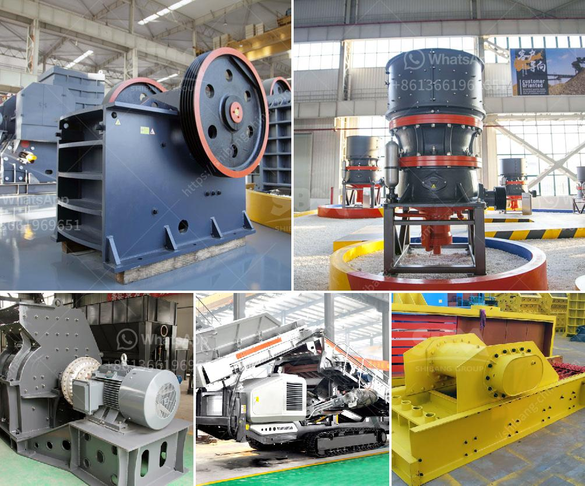

<h3>vertical shaft impact crusher price</h3>
Vertical shaft impact crusher is a type of crusher that uses a high-speed rotor to crush materials with impact force. It is designed to achieve a certain particle size by compressing and grinding materials. It is widely used in the construction and mining industries to produce sand and gravel. This article analyzes the factors influencing the price of vertical shaft impact crusher and provides a reference for purchasing.

Firstly, the brand awareness of the manufacturer is an important factor affecting the price. Well-known brands have better product quality, more reliable performance, and higher technical level. They have a strong competitiveness in the market, leading to a higher price. However, the investment is worth it as the quality of the crusher is guaranteed.

Secondly, the production cost of the vertical shaft impact crusher is also a factor that cannot be ignored. The high-quality materials and advanced manufacturing technology used in the production process will increase the cost. Therefore, the price of the crusher will also be higher. It is necessary to compare the prices of different manufacturers and choose a cost-effective option.

Additionally, the technical parameters of the crusher also influence its price. The capacity, feeding size, discharge size, and motor power are all important parameters affecting the price. A crusher with a larger capacity, smaller feeding size, smaller discharge size, and higher motor power will generally have a higher price. It is important to choose a crusher with appropriate technical parameters according to the specific needs of the project.

Furthermore, the sales strategy and after-sales service of the manufacturer will also have an impact on the price. Manufacturers with a good reputation often provide comprehensive after-sales service, including equipment installation, technical guidance, and regular maintenance. They also have a complete and reliable supply chain, ensuring the timely delivery and availability of spare parts. Although the price may be slightly higher, it is beneficial to choose a manufacturer with good sales and after-sales service.

Lastly, the market demand and competition will affect the price of the vertical shaft impact crusher. When there is a high demand for crushers in the market, manufacturers will increase their prices accordingly. On the other hand, when there is fierce competition among manufacturers, the price may be reduced to attract more customers. It is essential to keep an eye on market trends and conduct a comprehensive market analysis before making a purchasing decision.

In conclusion, the price of vertical shaft impact crusher is influenced by multiple factors, including the brand awareness of the manufacturer, production cost, technical parameters, sales strategy, after-sales service, and market demand. It is crucial to consider these factors comprehensively and choose a cost-effective crusher that meets the specific requirements.
<h3>Contact us</h3><ul><li><strong>Whatsapp:&nbsp;<a href="https://wa.me/8613661969651">+8613661969651</a></strong></li><li><a href="https://swt.shibang-china.com/?git&amp;zhl&amp;vertical shaft impact crusher price"><strong>Online Service(chat now)</strong></a></li></ul><h3>Related</h3><ul><li><a href='gold mining equipments africa.md'>gold mining equipments africa</a></li><li><a href='gravel sand wash plants canada for sale.md'>gravel sand wash plants canada for sale</a></li><li><a href='tons per hour mobile crushers.md'>tons per hour mobile crushers</a></li><li><a href='business plan for marble and granite factory pdf.md'>business plan for marble and granite factory pdf</a></li><li><a href='spec vibrating screen.md'>spec vibrating screen</a></li></ul>