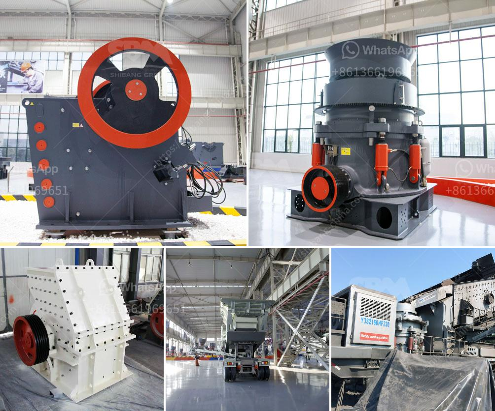

<h3>vibrating screen designs</h3>
Vibrating screens are widely used in various industrial applications to separate and sort different materials based on their size and shape. These screens consist of a vibrating mechanism, motor, and a deck where materials are poured onto the deck and distributed evenly. The vibrating mechanism generates vibrations that pass through the deck, causing the particles to move and separate accordingly.

When it comes to vibrating screen designs, there are several factors to consider in order to optimize the efficiency and performance of the screen. One of the key aspects is the vibration frequency or amplitude. The frequency determines how many times the screen deck vibrates per minute, while the amplitude determines the extent of the vibrations. Both of these factors can be adjusted to match the specific requirements of the application.

Another important design factor is the screen's inclination or slope. The slope of the screen deck plays a crucial role in the separation process. A steeper slope allows for faster and more efficient separation, while a shallower slope is suitable for materials that require slower screening.

Screen designs also differ based on their deck configurations. There are single-deck screens that have a single surface where the materials are screened, as well as multi-deck screens that have multiple surfaces stacked on top of each other. Multi-deck screens are ideal for applications where a high degree of separation is necessary.

Moreover, the design of the vibrating mechanism and motor are equally important. These components should be robust and durable to withstand the constant vibrations and heavy loads. Additionally, they should be designed in a way that minimizes maintenance requirements and optimizes energy efficiency.

In conclusion, designing efficient and reliable vibrating screens involves careful consideration of factors such as vibration frequency, amplitude, deck slope, and deck configuration. By selecting the right combination of these design elements, industries can achieve optimal screening performance, improve product quality, and enhance overall productivity.
<h3>Contact us</h3><ul><li><strong>Whatsapp:&nbsp;<a href="https://wa.me/8613661969651">+8613661969651</a></strong></li><li><a href="https://swt.shibang-china.com/?git&amp;zhl&amp;vibrating screen designs"><strong>Online Service(chat now)</strong></a></li></ul><h3>Related</h3><ul><li><a href='stone crushers machine price in nepal.md'>stone crushers machine price in nepal</a></li><li><a href='limestone crusher equipment.md'>limestone crusher equipment</a></li><li><a href='vibrating screen for aggregates.md'>vibrating screen for aggregates</a></li><li><a href='sand making machine suppliers in south africa.md'>sand making machine suppliers in south africa</a></li><li><a href='mobile screening plant south africa.md'>mobile screening plant south africa</a></li></ul>