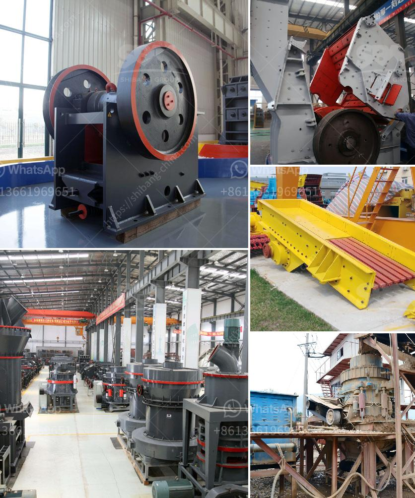

<h3>vibrating screen for aggregates</h3>
Vibrating screens are widely used in the processing of aggregates, especially for grading and screening operations. However, due to their limitations in size, efficiency, and capacity, they are not suitable for large-scale aggregates production. This article will explore the key features and benefits of vibrating screens for aggregates, along with their limitations.

Vibrating screens for aggregates are specifically designed to separate materials into various sizes for further processing or end use. They consist of a deck that is vibrated with a circular motion, causing the particles to move horizontally. This motion ensures efficient screening of the aggregates, as the vibrations and gravity work together to separate the different sizes.

One of the main advantages of vibrating screens is their ability to screen out both large and small particles efficiently. This is crucial in the aggregates industry, as particles of different sizes can have varying properties and applications. Whether it's gravel, sand, or crushed stone, each material needs to be screened to ensure quality and consistency.

Vibrating screens also offer several other benefits in aggregates processing. They provide high screening capacity, allowing for larger quantities of materials to be processed at once. This increases productivity and reduces the need for manual labor. Additionally, vibrating screens are versatile and can be adjusted to screen different types of aggregates, such as wet or dry materials.

Despite their numerous benefits, vibrating screens have some limitations. One of the main limitations is their size. They are generally limited in width and length, which can restrict the quantity of aggregate that can be processed at once. This makes them less suitable for large-scale production.

Furthermore, vibrating screens may not be the most energy-efficient option for aggregates processing. The vibrations and motion of the screen consume energy, which can lead to higher operating costs. In some cases, alternative screening methods, such as inclined screens or trommel screens, may be more energy-efficient and cost-effective.

In conclusion, vibrating screens play a crucial role in the aggregates industry by efficiently separating materials into different sizes. Their high screening capacity and versatility make them suitable for a wide range of applications. However, their limitations in size and energy efficiency should be considered when choosing the appropriate screening equipment for aggregates processing.
<h3>Contact us</h3><ul><li><strong>Whatsapp:&nbsp;<a href="https://wa.me/8613661969651">+8613661969651</a></strong></li><li><a href="https://swt.shibang-china.com/?git&amp;zhl&amp;vibrating screen for aggregates"><strong>Online Service(chat now)</strong></a></li></ul><h3>Related</h3><ul><li><a href='processing of limestone and crushing.md'>processing of limestone and crushing</a></li><li><a href='rumus menghitung berat besi stanliss.md'>rumus menghitung berat besi stanliss</a></li><li><a href='grinding mill machine in greece.md'>grinding mill machine in greece</a></li><li><a href='tons per hour cement grinding plant.md'>tons per hour cement grinding plant</a></li><li><a href='sand crushing equipment sale in tanzania.md'>sand crushing equipment sale in tanzania</a></li></ul>