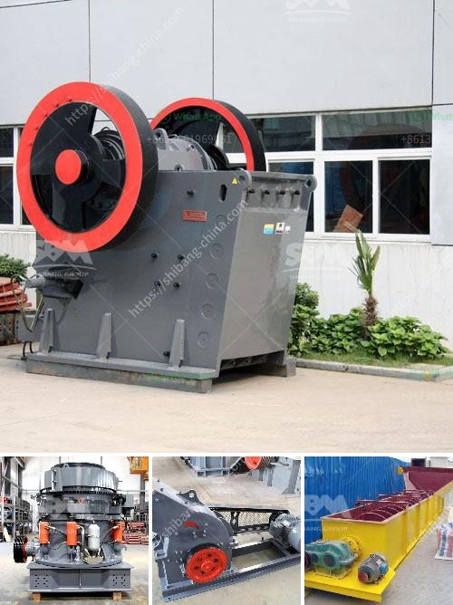

<h3>vibrating screen in cement plant</h3>
The vibrating screen is a valuable piece of equipment in the cement plant. It plays a crucial role in the production process as it separates the fine particles from the coarse particles, ensuring a consistent and high-quality final product. In this article, we will discuss the importance of the vibrating screen in the cement plant and how it contributes to the overall efficiency of the production process.

The cement manufacturing process involves several stages. First, the raw materials are extracted from the quarry and transported to the crushing plant, where they are crushed into smaller pieces. From there, the crushed materials are blended and transformed into a fine powder known as raw meal. This raw meal is then heated in a kiln at high temperatures to produce clinker, the main ingredient in cement.

During the different stages of the cement manufacturing process, various types of crushers, mills, and kilns are used. However, one equipment that is present in every stage of the process is the vibrating screen. Its primary function is to ensure that the raw materials and the final product are free from any impurities and of the desired particle size.

One of the main benefits of using a vibrating screen in the cement plant is its ability to quickly and efficiently separate the particles by size. It does this by using a vibrating motion that causes the particles to move across the screen. The smaller particles pass through the screen while the larger ones are retained on the surface, resulting in a separation of different particle sizes.

This separation process is essential in the cement plant as it allows for better control of the final product's quality. By ensuring that only the desired particle sizes pass through, the vibrating screen helps in producing a more consistent and high-quality cement. Additionally, it helps in removing any foreign materials or impurities that may be present in the raw materials.

Another benefit of using a vibrating screen in the cement plant is its ability to increase the overall efficiency of the production process. By separating the particles based on their size, the vibrating screen helps in reducing the amount of material that needs to be processed further. This, in turn, reduces the energy consumption and improves the productivity of the plant.

Furthermore, the vibrating screen requires very little maintenance and upkeep. It is designed to withstand the harsh conditions of the cement plant environment, such as high temperatures and abrasive materials. This ensures that the screen operates efficiently for a long period, minimizing downtime and maintenance costs.

In conclusion, the vibrating screen is an essential equipment in the cement plant. It plays a crucial role in the production process by separating the fine particles from the coarse particles, ensuring a consistent and high-quality final product. Its ability to separate particles by size contributes to the efficiency of the production process, while its low maintenance requirements make it a reliable and cost-effective solution.
<h3>Contact us</h3><ul><li><strong>Whatsapp:&nbsp;<a href="https://wa.me/8613661969651">+8613661969651</a></strong></li><li><a href="https://swt.shibang-china.com/?git&amp;zhl&amp;vibrating screen in cement plant"><strong>Online Service(chat now)</strong></a></li></ul><h3>Related</h3><ul><li><a href='three roller raymond mill.md'>three roller raymond mill</a></li><li><a href='clinker grinding machine.md'>clinker grinding machine</a></li><li><a href='stone crushers in cali.md'>stone crushers in cali</a></li><li><a href='antimony ore processing plant design.md'>antimony ore processing plant design</a></li><li><a href='crushers for aggregate production.md'>crushers for aggregate production</a></li></ul>