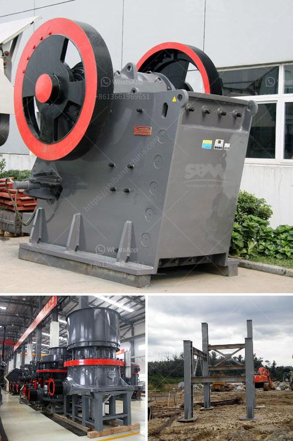

<h3>vibrating screen in south africa</h3>
Vibrating Screen Market is driven by rising adoption in construction and mining industry. According to a new market research report published by Credence Research Global Vibrating Screen Market (Product Type (Linear Vibrating Screen, Circular Vibrating Screen, Elliptical Vibrating Screen); Drive Type (Direct Drive, Indirect Drive); End-Use (Mining, Construction, Recycling, Agriculture, Others)) - Growth, Future Prospects, and Competitive Landscape, 2019 -2027”, the global vibrating screen market is expected to witness a growth of 7.8% during the forecast period from 2019 to 2027, starting from US$ 1.8 Bn in 2018.

Advancements in technology and innovation have made significant changes to the working principle, processing capacity, and application of vibrating screens. In addition, increasing inclination towards eliminating the use of manual labor in industrial sectors has resulted in the amplification of adoption for automated processes that utilize vibrating screens. These factors have greatly contributed to the growth of the vibrating screen market.

South Africa, a country located at the southern tip of Africa, is experiencing a significant increase in land development and infrastructure projects. This has led to a high demand for construction aggregates and mining materials, including vibratory screens. Vibrating screens can divide these materials into smaller ones and help in their appropriate usage during the construction process.

South Africa is also a major producer of minerals such as gold, diamonds, platinum, coal, etc. These minerals require vibrating screens to help refine and extract them from their initial ores. Vibrating screens are widely used in various minerals processing plants and quarries to separate the different minerals that are received from the mines.

Furthermore, agriculture is another important sector in South Africa, driving the growth of the vibrating screen market. Vibrating screens offer various benefits such as precision in separation, high capacity, and easy installation. These screens are widely used in the agricultural industry for separation and grading of various crops, including grains and seed.

To cater to the growing demand for vibrating screens, various South African companies are expanding their product range and capacity. Additionally, international players are also eyeing the South African market by setting up local manufacturing units or entering into partnerships with local players. This will further fuel the growth of the vibrating screen market in South Africa.

In conclusion, the vibrating screen market in South Africa is growing at a steady pace due to the rising adoption in the construction, mining, and agricultural sectors. Vibrating screens offer various benefits such as precision separation, ease of installation, and high capacity to the end-users. The market is expected to witness significant growth in the coming years as more infrastructure and mining projects are undertaken in the region.
<h3>Contact us</h3><ul><li><strong>Whatsapp:&nbsp;<a href="https://wa.me/8613661969651">+8613661969651</a></strong></li><li><a href="https://swt.shibang-china.com/?git&amp;zhl&amp;vibrating screen in south africa"><strong>Online Service(chat now)</strong></a></li></ul><h3>Related</h3><ul><li><a href='antimony ore processing plant design.md'>antimony ore processing plant design</a></li><li><a href='industrial crusher for sale.md'>industrial crusher for sale</a></li><li><a href='diamond mining equipment.md'>diamond mining equipment</a></li><li><a href='sand making machine suppliers in south africa.md'>sand making machine suppliers in south africa</a></li><li><a href='100 ton per day cement making plant.md'>100 ton per day cement making plant</a></li></ul>