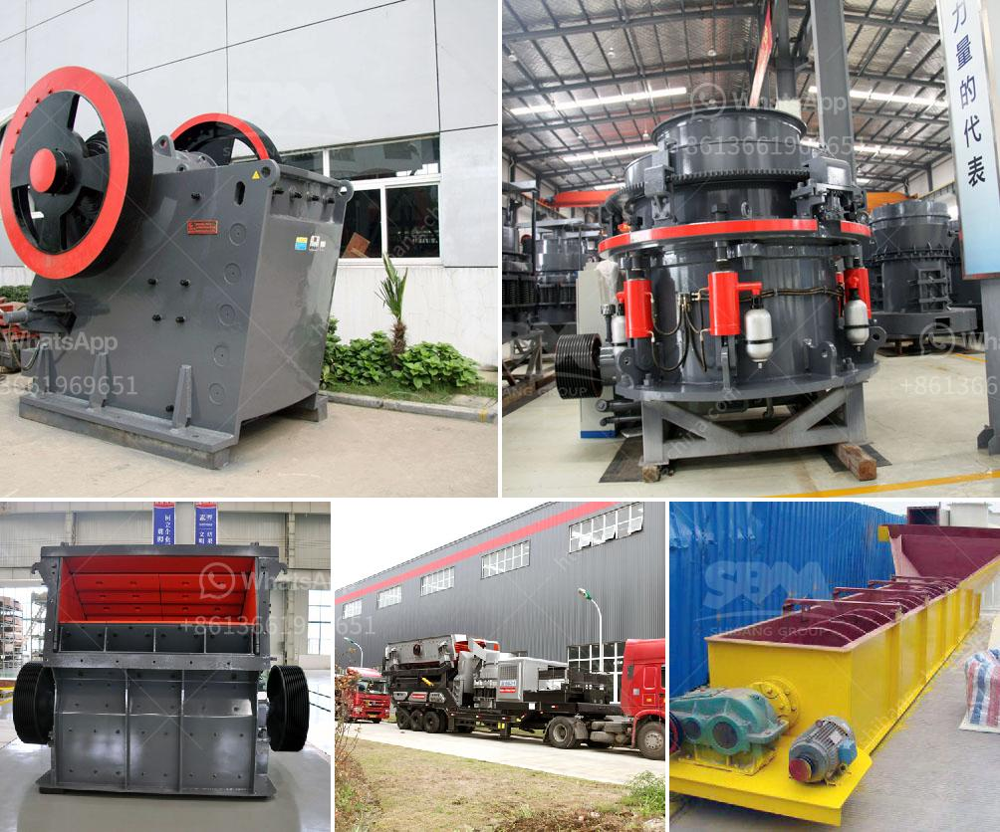

<h3>vibrating screen manufacturers in china</h3>
Vibrating screens are used to separate materials into various sizes for further processing or for end use. Materials are separated by passing through a vibrating screen box which has a number of screens of different sizes. Zhenying Machinery Technology Co., Ltd. is one of the leading manufacturers of vibrating screens in China.

Since its establishment in 2008, Zhenying Machinery has focused on the development and production of vibrating screen equipment. The company's main products include linear vibrating screens, circular vibrating screens, vibrating feeders, electromagnetic vibrating screens, vibrating conveyors, etc. With advanced production equipment, strong technical force, and a team of professional engineers, Zhenying Machinery has become a trusted brand in the vibrating screen industry.

One of the key factors that set Zhenying Machinery apart from other vibrating screen manufacturers is its commitment to innovation. The company invests heavily in research and development to continuously improve the performance and efficiency of its products. Zhenying Machinery has obtained a number of patents for its innovative vibrating screen designs, which effectively solve common problems encountered in the screening process, such as screen clogging and inefficient production.

Additionally, Zhenying Machinery has a strict quality control system in place to ensure the reliability and durability of its products. Each vibrating screen undergoes rigorous testing before leaving the factory to guarantee its performance and longevity. The company also provides comprehensive after-sales service to assist customers with any issues or questions they may have.

Zhenying Machinery is known for its excellent customer service. The company's highly skilled and responsive sales team is always available to provide professional advice and support to customers, helping them select the most suitable vibrating screen for their specific application. Zhenying Machinery understands that every customer's needs are unique and strives to provide customized solutions that meet their exact requirements.

In addition to its domestic market, Zhenying Machinery has also expanded its presence internationally, exporting its products to various countries around the world. With its high-quality product range and competitive prices, the company has gained a good reputation among customers both at home and abroad.

As a responsible vibrating screen manufacturer, Zhenying Machinery is also dedicated to environmental protection. The company adopts advanced production processes and materials that minimize energy consumption and reduce emissions. Zhenying Machinery's products are designed to be energy-efficient and environmentally friendly, helping customers achieve sustainable and cost-effective screening operations.

In conclusion, Zhenying Machinery is a leading vibrating screen manufacturer in China, known for its innovative products, superior quality, and excellent customer service. With its strong commitment to research and development, the company continues to push the boundaries of vibrating screen technology, providing efficient and reliable solutions to customers worldwide.
<h3>Contact us</h3><ul><li><strong>Whatsapp:&nbsp;<a href="https://wa.me/8613661969651">+8613661969651</a></strong></li><li><a href="https://swt.shibang-china.com/?git&amp;zhl&amp;vibrating screen manufacturers in china"><strong>Online Service(chat now)</strong></a></li></ul><h3>Related</h3><ul><li><a href='iron mining machine manufacturer.md'>iron mining machine manufacturer</a></li><li><a href='200tph mobile crusher prices used.md'>200tph mobile crusher prices used</a></li><li><a href='manufacturer of vertical coal pulverizer mill.md'>manufacturer of vertical coal pulverizer mill</a></li><li><a href='second hand equipment for sale in south africa.md'>second hand equipment for sale in south africa</a></li><li><a href='crushing and serreing machinery.md'>crushing and serreing machinery</a></li></ul>