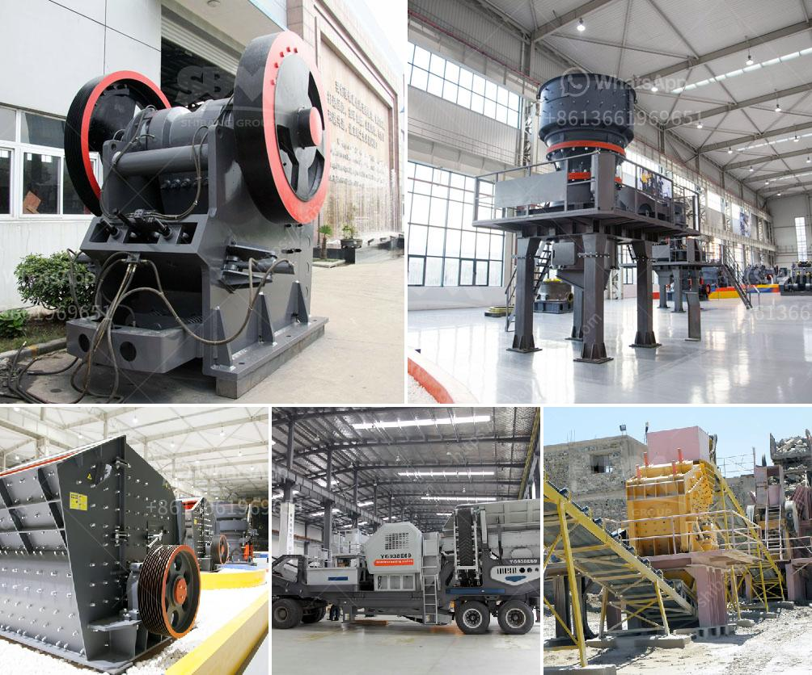

<h3>vibrating screen specification pdf</h3>
Vibrating screens are widely used in the mining and construction industries due to their ability to efficiently separate materials. Unlike static screens, vibrating screens are dynamic, which means they constantly move to classify and discharge materials. Vibrating screens are essential to the production process and their maintenance and design characteristics directly impact the overall efficiency and operation of the system. 

To ensure optimum productivity and avoid any downtime, it is crucial to have a clear understanding of the vibrating screen specification. This information can be found in a vibrating screen specification PDF, provided by the manufacturer. It contains details such as the overall dimensions, mesh size, material properties, and operating conditions. 

One of the most important aspects of a vibrating screen specification is the amplitude. It refers to the extent of movement of the screen surface. Amplitude affects the efficiency of material separation and the processing capacity of the equipment. Higher amplitude results in faster material transport but may decrease the accuracy of the separation. On the other hand, lower amplitude provides better separation accuracy but reduces the processing capacity. Therefore, the vibrating screen specification PDF should clearly state the recommended amplitude range for optimal performance based on the application and material characteristics.

Another vital aspect is the screening efficiency. This is measured by the percentage of material that passes through the screen's openings. Higher screening efficiency means more material is being correctly classified. The vibrating screen specification should indicate the expected screening efficiency for different mesh sizes and types of materials.

Additionally, the vibrating screen specification PDF should specify the type of screen media to be used. It may be wire mesh, perforated plate, rubber, or polyurethane. Different types of screen media have different advantages and disadvantages depending on factors such as the material being screened, required separation accuracy, and durability. The vibrating screen specification PDF should also indicate the thickness of the rubber or polyurethane liners used to protect the screen media from abrasion.

Other essential information found in a vibrating screen specification PDF includes the overall weight of the equipment, its size, and the power source required. These details are crucial for determining if the vibrating screen will fit into the available space and if the power supply is compatible with the equipment. 

In conclusion, a vibrating screen specification PDF is a valuable tool when purchasing vibrating screens for any mining or construction project. It provides an overview of the equipment's design characteristics and performance requirements, ensuring that the purchased equipment meets all specifications and operational needs. By carefully reviewing the vibrating screen specification PDF, buyers can make informed decisions and prevent any issues that may arise during equipment installation and operation.
<h3>Contact us</h3><ul><li><strong>Whatsapp:&nbsp;<a href="https://wa.me/8613661969651">+8613661969651</a></strong></li><li><a href="https://swt.shibang-china.com/?git&amp;zhl&amp;vibrating screen specification pdf"><strong>Online Service(chat now)</strong></a></li></ul><h3>Related</h3><ul><li><a href='dolomite refractory processing.md'>dolomite refractory processing</a></li><li><a href='tons per hour mobile crushers.md'>tons per hour mobile crushers</a></li><li><a href='crushed stone suppliers manufacture india.md'>crushed stone suppliers manufacture india</a></li><li><a href='machines used in sand and gravel quarry philippines.md'>machines used in sand and gravel quarry philippines</a></li><li><a href='grinding machines for clay.md'>grinding machines for clay</a></li></ul>