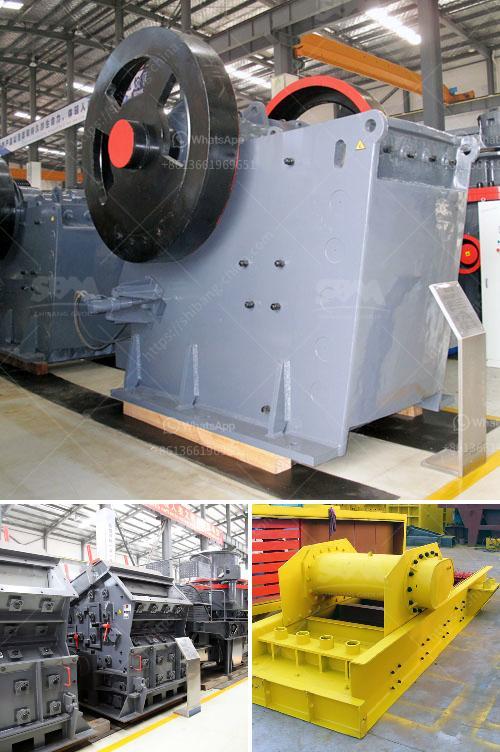

<h3>vibrating screen troubleshooting</h3>
Vibrating screens are used to separate and classify different sized particles in many industries such as mining, metallurgy, and chemical plants. However, their performance can be hindered by common problems that arise due to improper operation or maintenance. In this article, we will discuss some of the most common issues encountered with vibrating screens and provide troubleshooting steps to resolve them.

One of the most common problems experienced with vibrating screens is the lack of vibration or inadequate vibration. This can occur due to several reasons, such as worn-out belts, loose bolts, or old motor bearings. To troubleshoot this issue, first, make sure that the power supply is intact and correctly connected. Check the condition of the belts and replace them if they are worn out. Tighten all bolts and screws, as loose ones can impede the proper vibration. If the motor bearings are old, consider lubricating or replacing them.

Excessive vibration can lead to rapid wear and tear of the screen and other components. This issue may arise due to unbalanced loads, excessive feed rates, or damaged springs. To address this problem, start by checking the load distribution on the screen and ensure that the material is distributed evenly. If necessary, adjust the feed rate to match the screen's capacity. Inspect the springs and replace them if they are damaged or worn out.

Inefficient screening can be caused by a variety of factors, including clogged screen openings, low feed rates, and incorrect screen inclination. First, check if the screen openings are clogged with dirt, debris, or oversize material. Clean or replace the screen mesh as needed. Adjust the feed rate to ensure it is sufficient for effective screening. Consider adjusting the screen inclination to optimize the screening process.

Excessive noise is not only a nuisance but can also indicate underlying issues with the vibrating screen. This can be caused by loose or damaged components, improper installation, or lack of maintenance. To reduce noise levels, inspect all components for loose or damaged parts and tighten or replace them accordingly. Ensure that the screen is properly installed, and all fasteners are secure. Regularly clean and lubricate the screen to minimize noise from friction.

Blocking or blinding occurs when the screen openings become clogged with fine particles or sticky material, resulting in reduced screening efficiency. This can be resolved by installing screen cleaning devices such as sliders, balls, or brushes. Ensure that the cleaning devices are properly positioned and functioning effectively. Consider using screen media with self-cleaning capabilities to minimize blocking or blinding issues.

In conclusion, troubleshooting vibrating screens requires a systematic approach to identifying and addressing common problems. Regular inspection, maintenance, and proper operation are crucial for ensuring optimal performance and extending the screen's lifespan. By following the troubleshooting steps outlined in this article, operators can resolve common issues and maintain the efficiency of their vibrating screens.
<h3>Contact us</h3><ul><li><strong>Whatsapp:&nbsp;<a href="https://wa.me/8613661969651">+8613661969651</a></strong></li><li><a href="https://swt.shibang-china.com/?git&amp;zhl&amp;vibrating screen troubleshooting"><strong>Online Service(chat now)</strong></a></li></ul><h3>Related</h3><ul><li><a href='business plan of processing of calcium carbonate.md'>business plan of processing of calcium carbonate</a></li><li><a href='stone crusher equipment for sale.md'>stone crusher equipment for sale</a></li><li><a href='iron sand arator in philippines.md'>iron sand arator in philippines</a></li><li><a href='equipment costs for cement plant.md'>equipment costs for cement plant</a></li><li><a href='coal mill in power plant.md'>coal mill in power plant</a></li></ul>