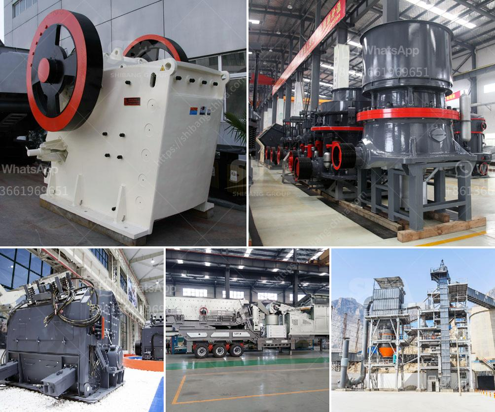

<h3>vibrating sieving machine</h3>
In the realm of industrial processes, the need to separate materials based on their size or composition is of paramount importance. And this is where vibrating sieving machines prove to be invaluable tools. These machines, also known as vibrating screens or sieves, play a crucial role in industries such as chemical, pharmaceutical, food processing, ceramics, and more. In this article, we will delve into the details of vibrating sieving machines, exploring their working principles, applications, and benefits.

A vibrating sieving machine consists of a vibrating motor, a screen/filter, and a frame that holds the screen in place. It utilizes the rapid vibrations generated by the motor to separate and classify particles. Several layers of different-sized screens or sieves are stacked on top of each other, ensuring maximum efficiency in the separation process.

The working principle of a vibrating sieving machine is quite simple yet effective. The motor, when switched on, generates intense vibrations that cause the screen to shake. When a mixture of materials is poured onto the sieve, the vibrating action separates the particles based on their sizes. Smaller particles pass through the holes on the screen, while larger ones are retained. This separation can be achieved through various sieve sizes, ensuring versatility in sorting materials according to desired specifications.

The applications of vibrating sieving machines are extensive and diverse. In the chemical industry, these machines are used to separate solid particles from liquid solutions or to separate different-sized particles during the manufacturing process. In the pharmaceutical industry, vibrating sieving machines are employed for quality control purposes, ensuring that only particles of a particular size are included in medications. In the food processing industry, the machines can efficiently remove foreign particles and impurities from food ingredients, guaranteeing a safer and cleaner product.

One of the key benefits of vibrating sieving machines is their ability to improve the efficiency of industrial operations. By automating the particle separation process, these machines save time and labor costs. They are capable of screening a large quantity of materials at a faster pace compared to manual methods, thus enhancing overall productivity. Vibrating sieving machines also ensure accuracy in the separation process, consistently providing reliable results while minimizing human errors.

Moreover, vibrating sieving machines improve the quality of the final products. By effectively separating particles based on their sizes, these machines enhance the uniformity and consistency of products. This is particularly crucial in industries where product quality is of utmost importance, such as pharmaceutical and food processing.

Furthermore, vibrating sieving machines are designed to be compact and easy to maintain. Most machines are equipped with user-friendly controls, allowing operators to adjust settings according to specific requirements. They are also built with durable materials that can withstand frequent vibrations, ensuring long-term usage without compromising performance.

In conclusion, vibrating sieving machines are indispensable tools in various industrial sectors. Their ability to separate and classify particles offers numerous benefits, including increased productivity, improved product quality, and ease of operation and maintenance. As industries continue to evolve and strive for excellence, vibrating sieving machines remain a fundamental aspect of industrial processes, contributing to overall efficiency and success.
<h3>Contact us</h3><ul><li><strong>Whatsapp:&nbsp;<a href="https://wa.me/8613661969651">+8613661969651</a></strong></li><li><a href="https://swt.shibang-china.com/?git&amp;zhl&amp;vibrating sieving machine"><strong>Online Service(chat now)</strong></a></li></ul><h3>Related</h3><ul><li><a href='small stone crusher in kenya.md'>small stone crusher in kenya</a></li><li><a href='roller mill sizes.md'>roller mill sizes</a></li><li><a href='stones grinding plant thailand.md'>stones grinding plant thailand</a></li><li><a href='cement clinker grinding equipmenttpd.md'>cement clinker grinding equipmenttpd</a></li><li><a href='3 roller raymond mill delhi.md'>3 roller raymond mill delhi</a></li></ul>