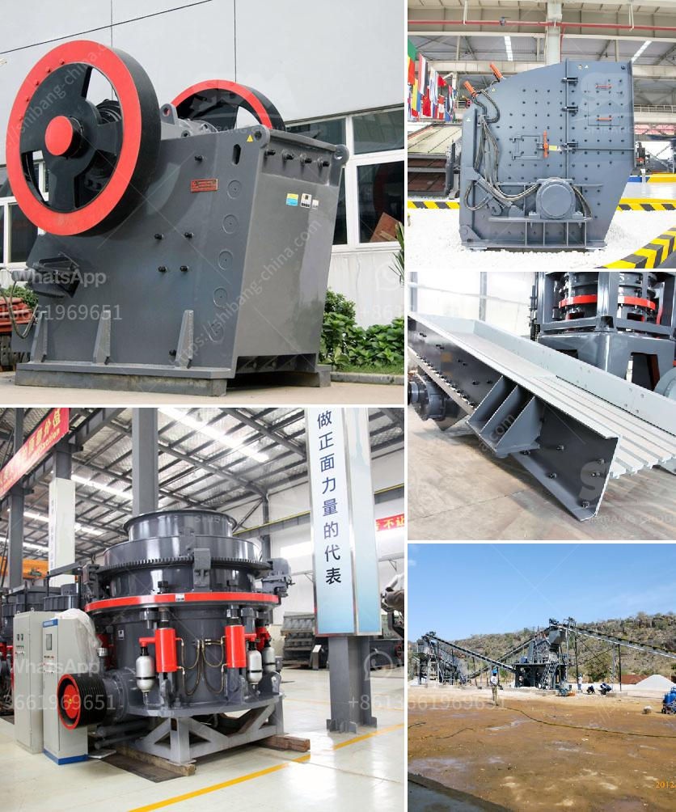

<h3>vsi stone crusher operation principle</h3>
VSI stone crusher operation principle is quite similar to sand making machine. They all use "rock on rock" crushing technology. The primary difference is that a VSI crusher uses a high-speed rotor and anvils for impact crushing rather than compression force for the energy needed for size reduction. In a VSI, material is accelerated by centrifugal force by a rotor against the outer anvil ring. It then impacts with striking energy, gets shattered, and falls onto the anvil ring to be crushed again. This process is repeated until the desired size reduction is achieved.

The key operating principle of a VSI crusher is that particles are fed into a crushing chamber designed to 'throw' the rock against a crushing anvil. This process ensures that all particles get broken down to the required size for further processing. The material is fed into the center of the rotor, which accelerates the particles to high speed. As a result of the high speed and centrifugal force, the particles are thrown against the anvils that line the crushing chamber. This impact causes the particles to break and shatter into smaller pieces.

The VSI stone crusher is efficient, versatile, and produces manufactured sand or finely crushed stone for various construction applications. It is an essential equipment in mining, metallurgy, construction, highway, railway, and chemical industries. Many models are available based on different crushing capacities, rotor configurations, and adjustment mechanisms.

To ensure optimal operation and maximum productivity, operators should regularly inspect and maintain the VSI crusher. This includes checking for wear and tear on the rotor and anvils, ensuring the correct lubrication of bearings, and monitoring the overall performance of the machine.

In conclusion, the operation principle of a VSI stone crusher revolves around the rock-on-rock crushing technology. It is a versatile and efficient crushing machine that produces high-quality manufactured sand or finely crushed stone for various construction applications. Regular maintenance and inspection are crucial to ensure optimal operation and prolong the lifespan of the equipment.
<h3>Contact us</h3><ul><li><strong>Whatsapp:&nbsp;<a href="https://wa.me/8613661969651">+8613661969651</a></strong></li><li><a href="https://swt.shibang-china.com/?git&amp;zhl&amp;vsi stone crusher operation principle"><strong>Online Service(chat now)</strong></a></li></ul><h3>Related</h3><ul><li><a href='granite quarry crusher in nigeria.md'>granite quarry crusher in nigeria</a></li><li><a href='stone crush machine price in pakistan.md'>stone crush machine price in pakistan</a></li><li><a href='crusher for sale peru.md'>crusher for sale peru</a></li><li><a href='setting up a 100 tpd cement grinding unit.md'>setting up a 100 tpd cement grinding unit</a></li><li><a href='prices of iron ore crushers.md'>prices of iron ore crushers</a></li></ul>