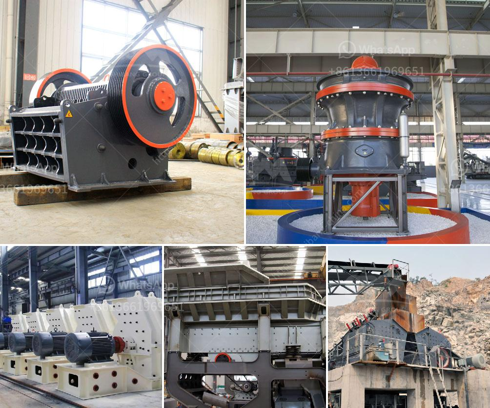

<h3>wet process and dry process of cement</h3>
Cement is a vital building material used in various construction projects worldwide. It is primarily manufactured from limestone, clay, shells, and silica sand. The manufacturing process of cement involves two distinct methods: wet process and dry process.

The wet process of cement manufacturing refers to grinding raw material into slurry after mixing with water and then feeding them into the kiln for proper burning. The water content is generally between 30-40%, and it is essential to ensure uniform mixing and proper moisture content to produce high-quality cement.

The wet process begins with the extraction of raw materials from the quarry, which are then crushed and mixed with water in a ball mill to form a slurry. The slurry is then stored in slurry tanks, where it remains for a specific period to achieve the desired consistency. The slurry is then fed into a rotary kiln, where it is heated to extremely high temperatures (between 1450-1500°C) to allow chemical reactions to occur.

During the heating process, the water content in the slurry evaporates, and the raw materials chemically transform into clinker. Clinker refers to the nodules, ranging in size from 1mm to 25mm, that form during the cooling period of the kiln. After cooling, the clinker is mixed with gypsum and ground into a fine powder to produce cement.

The wet process of cement manufacturing has its advantages. It allows for better control of the chemical composition and ensures a more homogeneous mixture. This leads to a higher quality end product with improved strength and durability. Additionally, the wet process results in lower energy consumption during the manufacturing process due to reduced kiln temperature requirements.

On the other hand, the dry process of cement manufacturing involves grinding raw materials into a fine powder, mixing them without water, and then feeding them into the kiln for calcination. In this process, the moisture content of the raw materials should not exceed 5%. The dry process avoids the use of water during mixing and reduces the energy consumption needed for evaporation during the calcination process.

The dry process begins with the extraction and crushing of raw materials, followed by their fine grinding in a tube mill. The ground raw material is then transported to a blending silo, where it is homogenized by mixing with additives such as gypsum and limestone. This mixture is then fed into a preheater tower, where it is heated to around 900°C before entering the rotary kiln.

In the kiln, the raw materials are subjected to temperatures reaching 1450-1500°C, resulting in the formation of clinker. After cooling, the clinker is again ground into a fine powder, mixed with gypsum, and transformed into cement.

The dry process has its own advantages, such as shorter kiln length and lower maintenance requirements. It is also easier to control the chemical composition in the dry process due to the absence of water. However, the absence of water may lead to dust formation, making the dry process less favorable in terms of environmental impact and workplace safety.

Both wet and dry processes have their own merits and are utilized depending on various factors such as raw material characteristics, energy requirements, quality requirements, and environmental considerations. Cement manufacturers carefully evaluate these factors to determine the most suitable manufacturing process for their specific requirements.

In conclusion, the wet and dry processes of cement manufacturing differ in terms of the method of mixing raw materials, water usage, and energy consumption. The wet process involves the use of water and provides better control over the chemical composition, resulting in a higher quality cement. The dry process, on the other hand, eliminates water usage and reduces energy consumption, but may lead to dust formation. Cement manufacturers select the appropriate process based on various factors to ensure the production of high-quality cement.
<h3>Contact us</h3><ul><li><strong>Whatsapp:&nbsp;<a href="https://wa.me/8613661969651">+8613661969651</a></strong></li><li><a href="https://swt.shibang-china.com/?git&amp;zhl&amp;wet process and dry process of cement"><strong>Online Service(chat now)</strong></a></li></ul><h3>Related</h3><ul><li><a href='concrete crushing machine for sale.md'>concrete crushing machine for sale</a></li><li><a href='ball mill suppliers in hyderabad.md'>ball mill suppliers in hyderabad</a></li><li><a href='size of ball mill with cspacity 280 tph.md'>size of ball mill with cspacity 280 tph</a></li><li><a href='grinding a stone crusher.md'>grinding a stone crusher</a></li><li><a href='old stone crusher for sale.md'>old stone crusher for sale</a></li></ul>