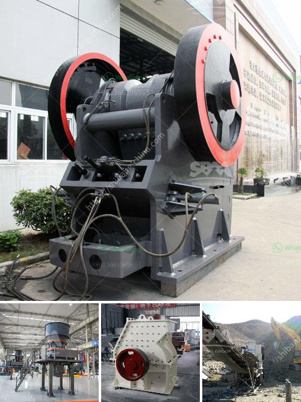

<h3>white cement plant machinery manufacturers</h3>
White cement is a specialized form of cement that is used in various construction applications. It is known for its unique white color, which is achieved by using raw materials that have low iron content. White cement is primarily used in architectural projects, where aesthetics and visual appeal are critical.

To produce white cement, specialized machinery and equipment are required. White cement plant machinery manufacturers play a crucial role in the production of white cement. These manufacturers design and develop machinery specifically tailored to the unique requirements of white cement production.

White cement plant machinery manufacturers offer a wide range of machinery and equipment, including kilns, crushers, mills, silos, and packing machines. Each piece of machinery is designed to ensure maximum efficiency and productivity in the manufacturing process.

One of the key pieces of machinery in white cement production is the kiln. Kilns are used to heat the raw materials at high temperatures, where chemical reactions take place, transforming the raw materials into white cement. White cement kilns are specifically designed to minimize the iron content in the final product, ensuring the desired white color.

Crushers and mills are also essential in the production process. They are used to crush and grind the raw materials, making them suitable for the next stages of production. Crushers and mills are designed to handle the unique characteristics of white cement raw materials, ensuring efficient grinding and processing.

Silos are used to store the raw materials before they go into the kiln. These silos are designed to maintain the quality and integrity of the raw materials, preventing contamination or degradation. Silos are often equipped with advanced technologies to monitor and control the storage conditions, ensuring the optimal quality of the raw materials.

Packing machines are essential for the final stage of white cement production – packaging. These machines ensure accurate and efficient packaging of the white cement, ready for transportation and use. White cement packing machines are designed to handle the unique characteristics of white cement, such as its fineness and flowability.

White cement plant machinery manufacturers invest significant resources in research and development to continuously improve their machinery. They work closely with cement producers to understand their specific requirements and challenges, developing innovative solutions to address them. Continuous improvement in machinery and equipment ensures the production of high-quality white cement efficiently and cost-effectively.

In conclusion, white cement plant machinery manufacturers play a crucial role in the production of white cement. Their specialized machinery and equipment are designed to meet the unique requirements of white cement production, ensuring maximum efficiency and productivity. These manufacturers invest in research and development to continuously improve their machinery and provide innovative solutions to the cement industry. Thanks to their expertise, the production of white cement continues to meet the highest standards of quality and visual appeal in various architectural projects.
<h3>Contact us</h3><ul><li><strong>Whatsapp:&nbsp;<a href="https://wa.me/8613661969651">+8613661969651</a></strong></li><li><a href="https://swt.shibang-china.com/?git&amp;zhl&amp;white cement plant machinery manufacturers"><strong>Online Service(chat now)</strong></a></li></ul><h3>Related</h3><ul><li><a href='mobile crushers for hire in product.md'>mobile crushers for hire in product</a></li><li><a href='raymond mill mumbai and africa.md'>raymond mill mumbai and africa</a></li><li><a href='ball mill nigeria.md'>ball mill nigeria</a></li><li><a href='antimony ore processing plant design.md'>antimony ore processing plant design</a></li><li><a href='mobile crusher in saudi.md'>mobile crusher in saudi</a></li></ul>