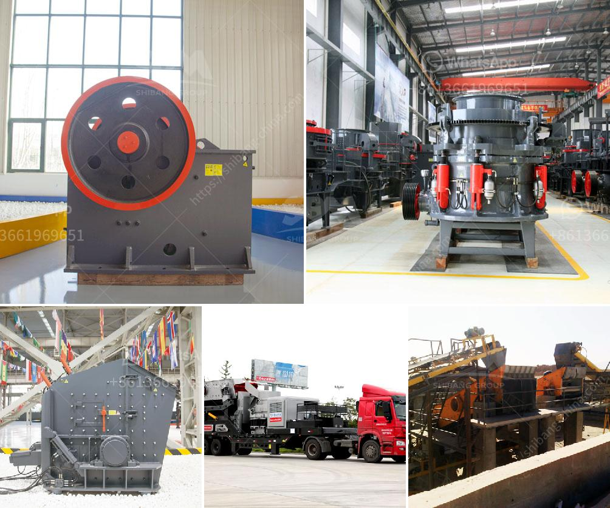

<h3>white stone crusher plant in rajasthan</h3>
Rajasthan is state of white stone crushers located in the western region of India. It is rich in limestone and marble mines, and it is renowned for its white stone crafts. White stone crusher plants have been manufacturing quality sand and aggregates for construction purposes since its inception. The state's rich cultural heritage and natural resources have attracted several entrepreneurs to set up white stone crusher plant in the region.

White stone is widely used in diverse applications, such as construction of roads, bridges, buildings, and railway tracks, among others. It is also a popular choice for landscaping and decorative purposes. The white stone crusher plant in Rajasthan has abundant white stone reserves and offers a wide range of products, such as White Marble Chips, White Silica Sand, White Dolomite Powder, and White River Pebbles.

The state is blessed with an abundance of limestone and marble mines, which form the raw material for white stone crusher plants. Most of these mines belong to private players, who have modernized the mining techniques to extract maximum quantity of white stone. The extracted stone is sent to the crushing plants, where the large sized rocks are crushed into smaller stone aggregates and powders.

The primary crushers used in white stone crusher plants are jaw crushers and cone crushers, which are capable of crushing various types of stones. These crushers produce cubical-shaped end products, which are highly in demand in the construction industry. The secondary crushers used in the plants are impact crushers and VSI crushers, which give a final touch to the crushed stones.

The white stone crusher plants in Rajasthan have a stable production capacity, and therefore, the stone aggregates and sand are produced in large quantities to meet the increasing demands of the construction industry and infrastructure projects. With the availability of abundant raw material, these plants are capable of producing high-quality products at competitive prices.

The white stone crusher plant includes large crushers, small crushers, and mobile crushers, which can be customized according to the customer's specific requirements. The white stone crusher plants in Rajasthan feature a large crushing ratio and high production efficiency, with low operating costs.

White stone crusher plant in Rajasthan also plays a crucial role in the construction of railways and highways, as well as in water conservancy, metallurgy, and other industries. The crushing plant has the advantages of easy transportation, low transportation cost, flexible configuration, convenient maintenance, etc. It can be operated as an independent unit or as a two-stage crushing plant with primary and secondary crushing, or as a three-stage crushing plant with primary, secondary, and tertiary crushing, as required by the customer.

In conclusion, the white stone crusher plants in Rajasthan not only offer a wide range of products but also provide employment opportunities to the local population. The presence of stabilized and modern infrastructure facilities in the state ensures smooth transportation and delivery of the crushed stones and aggregates to various construction sites within the region. The white stone crusher plants in Rajasthan continue to play a vital role in the growth and development of the state's construction industry, meeting the ever-increasing demands of infrastructure projects and supporting the economic growth of the region.
<h3>Contact us</h3><ul><li><strong>Whatsapp:&nbsp;<a href="https://wa.me/8613661969651">+8613661969651</a></strong></li><li><a href="https://swt.shibang-china.com/?git&amp;zhl&amp;white stone crusher plant in rajasthan"><strong>Online Service(chat now)</strong></a></li></ul><h3>Related</h3><ul><li><a href='processing plant for chrome for sale.md'>processing plant for chrome for sale</a></li><li><a href='set up stone crusher plant.md'>set up stone crusher plant</a></li><li><a href='crusher stone machine price.md'>crusher stone machine price</a></li><li><a href='european jaw crusher.md'>european jaw crusher</a></li><li><a href='grinding roller mill.md'>grinding roller mill</a></li></ul>