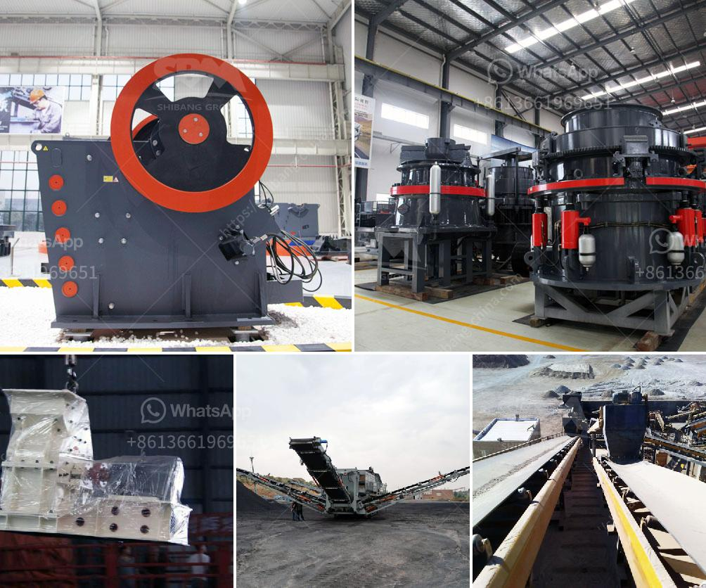

<h3>widely used small stone jaw crusher crusher</h3>
Small stone jaw crusher is versatile and efficient, making it the perfect tool for breaking down large stones into smaller pieces. It has the power to either reduce the size of stones to the desired output, or completely break them down into gravel for use in a construction site. With its heavy-duty construction and reliability, this tool has become widely used in mining operations around the world.

One of the main advantages of the small stone jaw crusher is its simplicity in design and operation. It consists of a fixed jaw and a movable jaw, which are arranged in a "V" shape. The movable jaw moves back and forth towards the fixed jaw, crushing the stones in between. This simple but effective mechanism allows for easy operation and maintenance, making it a popular choice among miners.

In addition to its simplicity, the small stone jaw crusher is also highly efficient. It is designed to crush stones with high hardness, such as granite and basalt. With a crushing capacity ranging from 5 to 60 tons per hour, the small stone jaw crusher is capable of handling small to medium-sized mining projects. With its compact size and easy maneuverability, it is also suitable for use in tight spaces and remote locations.

Another advantage of the small stone jaw crusher is its versatility. It can be used for various mining applications, including primary crushing, secondary crushing, and fine crushing. Whether you need to crush large stones into gravel or break down rocks for further processing, this tool can handle it all. Its adjustable discharge size also allows for precise control over the final product, ensuring that it meets the required specifications.

The small stone jaw crusher is not only used in mining operations but also in the construction industry. It can be used to crush stones for building materials, such as concrete and asphalt. Its ability to break down rocks of different sizes makes it ideal for creating aggregate materials used in road construction, making it a valuable asset for any construction project.

Overall, the small stone jaw crusher is a key tool for successful mining operations. Its simplicity, efficiency, and versatility make it an essential piece of equipment for any miner or contractor. Whether you are crushing stones for construction or mining purposes, this reliable tool will ensure that the job gets done efficiently and effectively. With its compact size and heavy-duty construction, the small stone jaw crusher is built to withstand the toughest conditions, making it a valuable investment for any mining or construction project.
<h3>Contact us</h3><ul><li><strong>Whatsapp:&nbsp;<a href="https://wa.me/8613661969651">+8613661969651</a></strong></li><li><a href="https://swt.shibang-china.com/?git&amp;zhl&amp;widely used small stone jaw crusher crusher"><strong>Online Service(chat now)</strong></a></li></ul><h3>Related</h3><ul><li><a href='sale of old hammer crusher.md'>sale of old hammer crusher</a></li><li><a href='used gold washer machine plant.md'>used gold washer machine plant</a></li><li><a href='crusher stone machine price.md'>crusher stone machine price</a></li><li><a href='sample proposal to supply mining equipment.md'>sample proposal to supply mining equipment</a></li><li><a href='gold mining compressor price in south africa.md'>gold mining compressor price in south africa</a></li></ul>