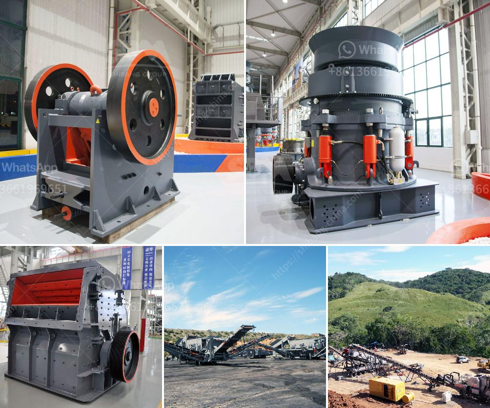

<h3>working principle of pebble mill</h3>
The pebble mill is a type of ball mill that is used in grinding materials into extremely fine powder. It works on the principle of impact and attrition: size reduction is done by impact as the balls drop from near the top of the shell. A pebble mill is a cylindrical machine with a hollow shell housing a tumbling mill that processes materials by rotating it on its axis, causing the balls inside of it to cascade, thus milling the materials.

The working principle of the pebble mill is quite simple. As the machine rotates and the materials inside the mill are brought into contact with the rotating balls, they are subjected to both impact and attrition forces. This leads to the reduction in size of the particles being processed.

The impact force occurs when the balls fall from a height due to gravity, colliding with the materials and causing them to break apart. As the balls continue to rotate within the mill, they also create a grinding action, known as attrition, by rubbing against the surface of the materials. This further contributes to the reduction in size of the particles.

The rotation of the pebble mill is driven by a motor, which causes the mill to rotate at a certain speed. The speed of rotation can be adjusted to control the grinding and milling process. The size and type of balls used in the pebble mill can also affect the outcome of the process.

The pebble mill is widely used in various industries, including mining, construction, and ceramics. It is often used in the production of cement, silicate products, refractory materials, fertilizers, glass, and ceramics. The fine powder produced by the pebble mill can be used in a variety of applications, such as coatings, paints, and ceramics.

One of the advantages of using a pebble mill is its versatility. It can be used for both wet and dry grinding, making it suitable for a wide range of materials. The pebble mill is also known for its high grinding efficiency and low energy consumption. It can grind materials to a very fine size, which is important in many industries.

In conclusion, the working principle of the pebble mill involves the rotation of a hollow shell housing a tumbling mill with balls inside. The materials to be processed are subjected to impact and attrition forces, resulting in the reduction in size of the particles. The rotation of the mill and the size and type of balls used can be adjusted to control the grinding and milling process. The pebble mill is widely used in various industries due to its versatility, high grinding efficiency, and low energy consumption.
<h3>Contact us</h3><ul><li><strong>Whatsapp:&nbsp;<a href="https://wa.me/8613661969651">+8613661969651</a></strong></li><li><a href="https://swt.shibang-china.com/?git&amp;zhl&amp;working principle of pebble mill"><strong>Online Service(chat now)</strong></a></li></ul><h3>Related</h3><ul><li><a href='impact crusher in lima peru.md'>impact crusher in lima peru</a></li><li><a href='mobile crushing alocation.md'>mobile crushing alocation</a></li><li><a href='pulverizer machines manufacturers.md'>pulverizer machines manufacturers</a></li><li><a href='calcium bromide manufacturing process.md'>calcium bromide manufacturing process</a></li><li><a href='pebble crushing production line.md'>pebble crushing production line</a></li></ul>