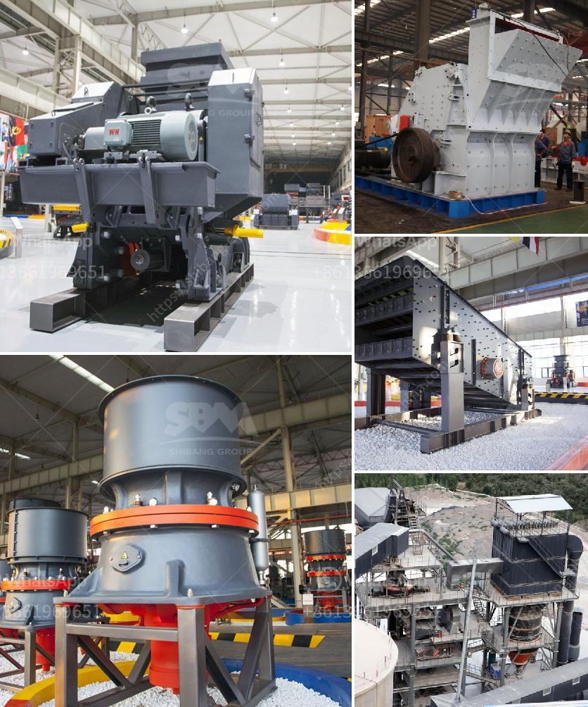

<h3>x36 double roller crusher used</h3>
The X36 double roller crusher is a robust and reliable machine designed to reduce large-sized minerals into smaller-sized particles. It is an efficient and cost-effective solution for breaking down materials such as limestone, granite, gravel, and more. This crusher is widely used in mining, construction, and other industries due to its superior performance and low maintenance requirements.

One of the standout features of the X36 double roller crusher is its dual-roll crushing design. The machine consists of two heavy-duty rollers mounted parallel to each other and operated in opposite directions. This setup allows for efficient and precise crushing action, ensuring uniform particle size distribution. The rollers are made of high-quality materials that resist wear and tear, prolonging their lifespan and reducing the need for frequent replacements.

With a maximum feeding size of up to 40mm, the X36 double roller crusher can handle large-sized minerals with ease. It utilizes a strong crushing force generated by the two rollers to break down the material into smaller pieces. The adjustable gap between the rollers allows for precise control over the final product size, enabling the machine to produce desired particle sizes ranging from coarse to fine.

The X36 double roller crusher is also equipped with a reliable hydraulic system that ensures smooth and safe operation. The system helps to prevent overloading and protects the machine from damage caused by excessive pressure. It also allows for easy adjustment of the crushing force and gap width, providing operators with greater control over the crushing process.

Furthermore, the X36 double roller crusher is designed with simplicity and ease of maintenance in mind. The machine is equipped with a removable crusher box that makes it convenient to access and clean the rollers. This reduces downtime and prolongs the service life of the machine, ensuring optimal productivity in the long run.

In conclusion, the X36 double roller crusher is a versatile and efficient machine that offers reliable crushing performance. Its dual-roll crushing design, adjustable gap width, and powerful hydraulic system make it an ideal choice for crushing large-sized minerals. Whether used in mining, construction, or other industries, this crusher can effectively reduce materials into smaller, more manageable sizes. Its robust construction and ease of maintenance make it a cost-effective solution for crushing needs.
<h3>Contact us</h3><ul><li><strong>Whatsapp:&nbsp;<a href="https://wa.me/8613661969651">+8613661969651</a></strong></li><li><a href="https://swt.shibang-china.com/?git&amp;zhl&amp;x36 double roller crusher used"><strong>Online Service(chat now)</strong></a></li></ul><h3>Related</h3><ul><li><a href='limestone crushing power consumption.md'>limestone crushing power consumption</a></li><li><a href='sand and gravel plant in nepal.md'>sand and gravel plant in nepal</a></li><li><a href='hammer mill prices in zimbabwe.md'>hammer mill prices in zimbabwe</a></li><li><a href='limestone jaw crusher sizes.md'>limestone jaw crusher sizes</a></li><li><a href='stone crusher plant set up procedure.md'>stone crusher plant set up procedure</a></li></ul>