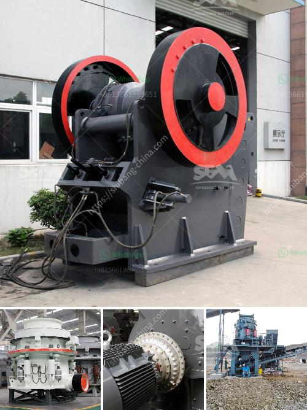

<h3>yd mobile crushing plant</h3>
The YD mobile crushing plant is a revolutionary solution for waste processing applications, which combines multiple functionalities in a single machine. Designed for ambitious professionals and contractors, this compact and easily transportable equipment can be used to process a wide range of materials such as construction waste, concrete, bricks, stones, and asphalt.

One prominent feature of the YD mobile crushing plant is its mobility. Equipped with heavy-duty tracks, this machine can be easily moved from one location to another, allowing users to process materials at various sites. Whether it is a remote construction site or a recycling facility, the YD mobile crushing plant ensures flexible and cost-effective operations.

The crushing unit of the YD mobile crushing plant consists of a robust jaw crusher and a double-deck vibrating screen. The powerful jaw crusher can handle any type of material with a compressive strength of up to 320 MPa. With advanced hydraulic controls, operators have full control over the crushing process and can regulate the size of the final product.

In addition to its primary crushing function, the YD mobile crushing plant also incorporates a screening system. The double-deck vibrating screen effectively separates the crushed material into different sizes, allowing for the production of various high-quality end products. Whether it is aggregates for construction or recycled materials for further processing, the YD mobile crushing plant delivers exceptional results.

The YD mobile crushing plant is not only efficient but also eco-friendly. With advanced dust suppression systems and low noise levels, this equipment minimizes environmental impact, making it a sustainable choice for companies committed to green practices.

In conclusion, the YD mobile crushing plant offers a versatile and efficient solution for waste processing applications. From its mobility and easy transportation to its powerful crushing capabilities, this compact machine ensures optimal productivity. With its advanced features and environmental benefits, the YD mobile crushing plant is a game-changer in the industry.
<h3>Contact us</h3><ul><li><strong>Whatsapp:&nbsp;<a href="https://wa.me/8613661969651">+8613661969651</a></strong></li><li><a href="https://swt.shibang-china.com/?git&amp;zhl&amp;yd mobile crushing plant"><strong>Online Service(chat now)</strong></a></li></ul><h3>Related</h3><ul><li><a href='limestone grinding mill.md'>limestone grinding mill</a></li><li><a href='hammer mill prices in zimbabwe.md'>hammer mill prices in zimbabwe</a></li><li><a href='how to make clay powder.md'>how to make clay powder</a></li><li><a href='mobile crusher seller.md'>mobile crusher seller</a></li><li><a href='cost of mobile crusher in india.md'>cost of mobile crusher in india</a></li></ul>