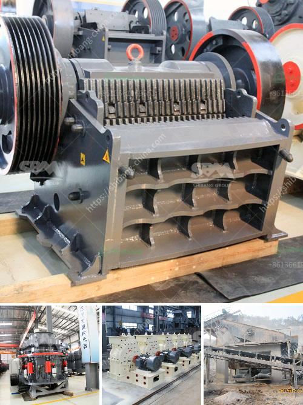

<h3>zeolite sand making machine manufacturer</h3>
In recent years, the demand for sand in construction, landscaping, and other industrial applications has increased significantly. As a result, traditional sand mining methods have become unsustainable and environmentally damaging. This has led to the rise of innovative technologies, such as zeolite sand making machines, which are revolutionizing the sand production industry.

One prominent manufacturer leading the way in this technological advancement is committed to providing sustainable and efficient solutions for sand production - the zeolite sand making machine manufacturer. With their cutting-edge technology and years of experience, they are changing the landscape of sand production and paving the way for a greener and more sustainable future.

Zeolite sand making machines utilize natural zeolite minerals, which are abundant and widely available. Zeolites are volcanic minerals that have unique properties, including high water absorbency, cation exchange capacity, and chemical stability. These properties make zeolites an ideal material for sand production.

One of the key advantages of zeolite sand making machines is their ability to produce high-quality sand with minimal environmental impact. Traditional sand mining methods often involve dredging rivers and lakes, leading to habitat destruction, water pollution, and erosion. Zeolite sand making machines, on the other hand, extract and process zeolite minerals from readily available sources, without causing any harm to the environment.

Furthermore, zeolite sand making machines use less energy compared to traditional sand mining methods. They incorporate advanced technologies, such as advanced crushing chambers and hydraulic systems, which increase efficiency and reduce energy consumption. This not only lowers production costs but also decreases the overall carbon footprint of the sand production process.

Zeolite sand making machines are also highly versatile and can produce sand in various sizes and specifications to meet different requirements. Whether it is fine sand for building construction or coarse sand for landscaping projects, these machines can be adjusted to produce the desired granularity. This flexibility makes zeolite sand making machines suitable for a wide range of applications.

Another advantage of choosing a zeolite sand making machine manufacturer is their commitment to customer satisfaction. They provide comprehensive technical support and after-sales service, ensuring that customers receive the necessary guidance and assistance throughout the sand production process. This level of support guarantees the smooth operation of the machines and maximizes their lifespan.

In conclusion, zeolite sand making machine manufacturers are leading the innovation in the sand production industry by offering sustainable and efficient solutions. These machines have revolutionized the way sand is produced, replacing traditional mining methods with environmentally friendly alternatives. With their advanced technology, energy efficiency, and versatility, zeolite sand making machines are paving the way for a greener and more sustainable future. By choosing a zeolite sand making machine manufacturer, individuals and businesses can contribute to a sustainable sand production process while meeting their sand supply needs.
<h3>Contact us</h3><ul><li><strong>Whatsapp:&nbsp;<a href="https://wa.me/8613661969651">+8613661969651</a></strong></li><li><a href="https://swt.shibang-china.com/?git&amp;zhl&amp;zeolite sand making machine manufacturer"><strong>Online Service(chat now)</strong></a></li></ul><h3>Related</h3><ul><li><a href='coal crusher design.md'>coal crusher design</a></li><li><a href='chinese stone crusher machine.md'>chinese stone crusher machine</a></li><li><a href='barite jaw crusher manufacturing companies.md'>barite jaw crusher manufacturing companies</a></li><li><a href='used portable crusher for sale in germany.md'>used portable crusher for sale in germany</a></li><li><a href='equipment cost for silica sand mining.md'>equipment cost for silica sand mining</a></li></ul>