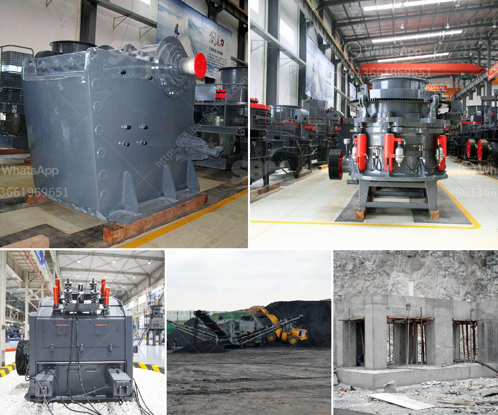

<h3>zinc ore processing plant</h3>
Zinc is an essential mineral that is widely used in industries such as paint, cosmetics, chemicals, metallurgy, and agriculture. This mineral is present in abundance in nature with zinc ore being one of the primary sources for obtaining zinc. Due to the increasing demand for zinc and its by-products, the establishment of a zinc ore processing plant is an excellent way to take advantage of this valuable natural resource efficiently.

The primary process in the zinc ore processing plant is the flotation method. This method is widely used for mineral concentration of non-ferrous metals such as zinc, lead, and copper. The flotation process consists of several stages by which the valuable minerals are separated from the impurities. In the case of zinc ore processing plant, the primary process involves initially grinding the zinc ore to a fine powder.

The finely powdered ore is then suspended in water and mixed with various reagents such as collectors, frothers, and modifiers. These chemicals help to selectively attach to the zinc particles while repelling the impurities. Air is then bubbled through the mixture, causing the zinc particles to float to the surface as a froth. This froth is skimmed off and transferred to another tank for further processing.

Next, the froth undergoes additional flotation processes to separate the zinc concentrate from other valuable minerals. This process involves adding more reagents to the froth to selectively separate the zinc concentrate, which contains a higher percentage of zinc. The remaining minerals, known as tailings, are discarded.

After obtaining the zinc concentrate, it is further processed to obtain pure zinc. This is usually done in a smelting furnace, where the zinc concentrate is heated at a high temperature to remove impurities. The remaining material is then cast into ingots or used for further processing to obtain zinc alloys.

It is important to note that while the flotation method is the primary process used in a zinc ore processing plant, there may be additional processes involved depending on the type and quality of the zinc ore. These additional processes may include roasting, leaching, or electro-winning, which are employed to recover zinc from different types of ores.

Furthermore, an efficient zinc ore processing plant should also prioritize environmental sustainability. Measures such as water recycling, proper waste management, and utilization of energy-efficient machinery should be implemented to minimize the plant’s environmental impact.

In conclusion, the establishment of a zinc ore processing plant is a lucrative investment opportunity due to the increasing demand for zinc and its by-products. The flotation method is the primary process used to extract zinc from its ore, with additional processes used depending on the ore quality. Ensuring environmental sustainability should be a priority for any zinc ore processing plant, thus making sure that this valuable natural resource is processed efficiently with minimal environmental impact.
<h3>Contact us</h3><ul><li><strong>Whatsapp:&nbsp;<a href="https://wa.me/8613661969651">+8613661969651</a></strong></li><li><a href="https://swt.shibang-china.com/?git&amp;zhl&amp;zinc ore processing plant"><strong>Online Service(chat now)</strong></a></li></ul><h3>Related</h3><ul><li><a href='silica sand washing dry process.md'>silica sand washing dry process</a></li><li><a href='gypsum production machinery.md'>gypsum production machinery</a></li><li><a href='jaw crusher with protection.md'>jaw crusher with protection</a></li><li><a href='hard rock quarry cursher in libya.md'>hard rock quarry cursher in libya</a></li><li><a href='hammer mill machines in indonesia.md'>hammer mill machines in indonesia</a></li></ul>